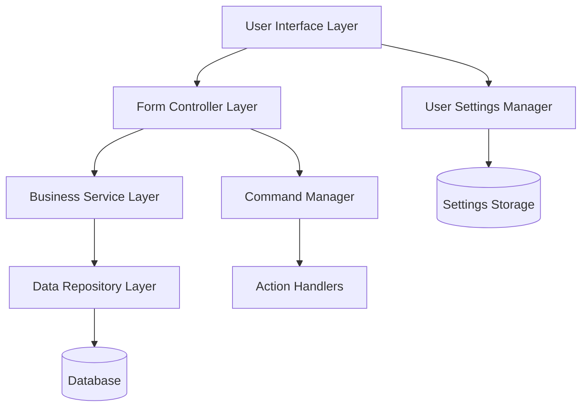
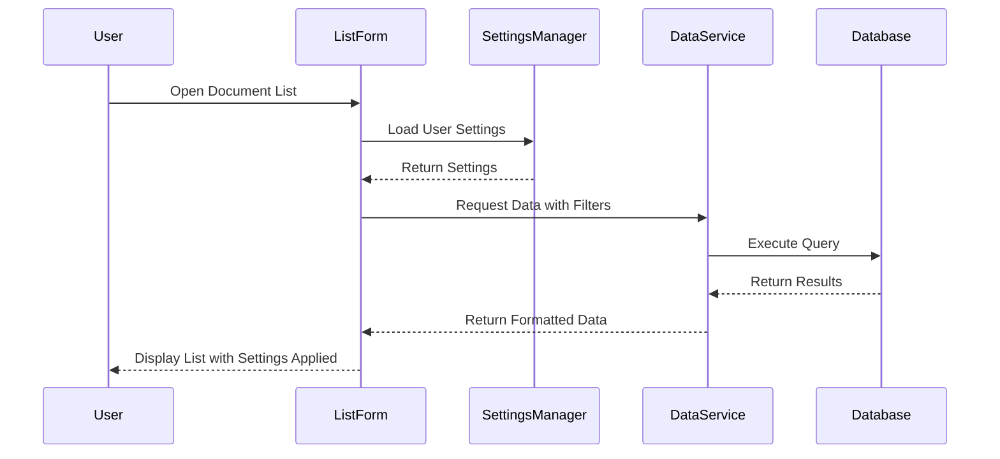
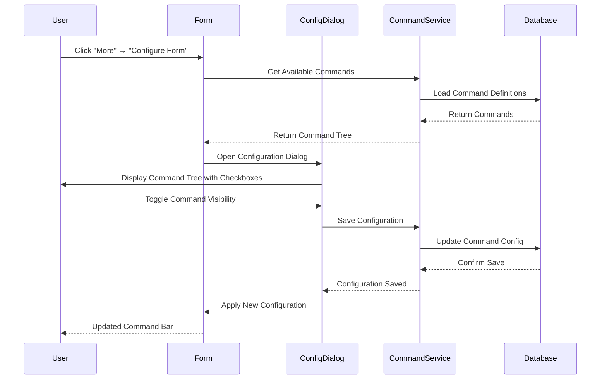

# Design Document: Document List Forms in 1C Platform

## Overview

This design document outlines the architecture and implementation approach for document list forms in the 1C platform. The system will provide a unified, configurable interface for displaying and managing document collections with consistent user experience across desktop and web clients. The design emphasizes performance, personalization, and adherence to 1C platform conventions.

## Architecture

### High-Level Architecture



### Component Interaction Flow



## Components and Interfaces

### 1. List Form Controller

**Responsibilities:**
- Manage form lifecycle and state
- Handle user interactions and events
- Coordinate between UI components and services
- Manage command execution

**Key Methods:**
```typescript
interface IListFormController {
    initialize(formConfig: FormConfiguration): void;
    loadData(filters?: FilterCriteria): Promise<DocumentData[]>;
    applyUserSettings(settings: UserSettings): void;
    executeCommand(command: CommandType, context: CommandContext): Promise<void>;
    handleColumnResize(columnId: string, width: number): void;
    handleSorting(columnId: string, direction: SortDirection): void;
}
```

### 2. User Settings Manager

**Responsibilities:**
- Persist and retrieve user preferences
- Manage column configurations
- Handle form-specific settings

**Key Methods:**
```typescript
interface IUserSettingsManager {
    saveColumnSettings(formId: string, settings: ColumnSettings): Promise<void>;
    loadColumnSettings(formId: string): Promise<ColumnSettings>;
    saveSortingPreferences(formId: string, sorting: SortingConfig): Promise<void>;
    saveFilterPreferences(formId: string, filters: FilterConfig): Promise<void>;
    resetToDefaults(formId: string): Promise<void>;
}
```

### 3. Command Manager

**Responsibilities:**
- Register and manage available commands
- Handle command visibility and availability
- Execute command actions

**Key Methods:**
```typescript
interface ICommandManager {
    registerCommand(command: Command): void;
    executeCommand(commandId: string, context: CommandContext): Promise<CommandResult>;
    getAvailableCommands(context: FormContext): Command[];
    isCommandEnabled(commandId: string, context: CommandContext): boolean;
}
```

### 4. Data Service

**Responsibilities:**
- Fetch document data with filtering and pagination
- Handle data transformations
- Manage caching strategies

**Key Methods:**
```typescript
interface IDataService {
    getDocuments(criteria: QueryCriteria): Promise<PagedResult<Document>>;
    getDocumentCount(filters: FilterCriteria): Promise<number>;
    exportDocuments(format: ExportFormat, criteria: QueryCriteria): Promise<ExportResult>;
    bulkOperation(operation: BulkOperation, documentIds: string[]): Promise<BulkResult>;
}
```

## Data Models

### Core Data Structures

```typescript
interface Document {
    id: string;
    number: string;
    date: Date;
    type: DocumentType;
    status: DocumentStatus;
    author: User;
    amount?: number;
    description?: string;
    attachments?: Attachment[];
    metadata: DocumentMetadata;
}

interface ColumnSettings {
    columns: ColumnConfiguration[];
    sortOrder: SortConfiguration[];
    hiddenColumns: string[];
    columnWidths: Record<string, number>;
}

interface FilterCriteria {
    dateRange?: DateRange;
    textSearch?: string;
    statusFilter?: DocumentStatus[];
    customFilters?: CustomFilter[];
}

interface CommandContext {
    selectedDocuments: Document[];
    currentUser: User;
    formType: FormType;
    permissions: Permission[];
}
```

### User Settings Schema

```typescript
interface UserSettings {
    userId: string;
    formId: string;
    columnSettings: ColumnSettings;
    filterPreferences: FilterPreferences;
    commandBarSettings: CommandBarSettings;
    dateRangeSettings: DateRangeSettings;
    lastModified: Date;
}

interface CommandBarSettings {
    visibleCommands: string[];
    hiddenCommands: string[];
    customOrder?: string[];
}
```

## Data Models

### Database Schema for Settings Storage

```sql
-- User form settings table
CREATE TABLE user_form_settings (
    id UUID PRIMARY KEY,
    user_id UUID NOT NULL,
    form_id VARCHAR(100) NOT NULL,
    settings_type VARCHAR(50) NOT NULL, -- 'columns', 'filters', 'commands', 'daterange'
    settings_data JSONB NOT NULL,
    created_at TIMESTAMP DEFAULT CURRENT_TIMESTAMP,
    updated_at TIMESTAMP DEFAULT CURRENT_TIMESTAMP,
    UNIQUE(user_id, form_id, settings_type)
);

-- Index for fast retrieval
CREATE INDEX idx_user_form_settings_lookup ON user_form_settings(user_id, form_id);
```

Now I need to use the prework tool before writing the Correctness Properties section.
## Correctness Properties

*A property is a characteristic or behavior that should hold true across all valid executions of a system—essentially, a formal statement about what the system should do. Properties serve as the bridge between human-readable specifications and machine-verifiable correctness guarantees.*

Based on the prework analysis, the following properties have been identified after eliminating redundancy:

### Property 1: Settings Persistence Round-Trip
*For any* user settings modification (column visibility, width, order, sorting, command bar, date range), saving and reopening the form should preserve the exact settings that were configured
**Validates: Requirements 2.2, 2.3, 2.4, 3.1, 8.5, 9.4, 10.1, 10.2, 10.3**

### Property 2: Pagination Behavior with Large Datasets
*For any* document list containing more than 1000 records, the system should automatically enable pagination and load only a subset of records initially
**Validates: Requirements 1.2**

### Property 3: Responsive Column Width Adaptation
*For any* window resize event, column widths should adjust proportionally while maintaining the relative sizing relationships
**Validates: Requirements 1.3**

### Property 4: Data Refresh Position Preservation
*For any* data update operation, the display should refresh while preserving the current scroll position and selected items
**Validates: Requirements 1.4**

### Property 5: Real-Time Search Filtering
*For any* text entered in the quick search field, the displayed records should be filtered in real-time to show only matching results
**Validates: Requirements 3.2**

### Property 6: Multi-Selection Behavior Consistency
*For any* selection operation (Ctrl+Click for multiple, Shift+Click for range), the visual selection state should accurately reflect the selected items and enable appropriate bulk operations
**Validates: Requirements 4.1, 4.2, 4.3**

### Property 7: Bulk Operation State Updates
*For any* completed bulk operation, all affected documents should have their status updated to reflect the operation results
**Validates: Requirements 4.5**

### Property 8: Conditional Indicator Display
*For any* document with specific attributes (attachments, processing status, validation errors), the appropriate visual indicators should be displayed in the list
**Validates: Requirements 5.3, 5.4, 5.5**

### Property 9: Access Control Column Visibility
*For any* user with restricted access permissions, columns that are inaccessible should be hidden from the interface
**Validates: Requirements 6.2, 6.4**

### Property 10: Conditional Formatting Application
*For any* row that matches administrator-defined formatting rules, the appropriate styles should be applied consistently
**Validates: Requirements 6.3**

### Property 11: Export Scope Accuracy
*For any* export operation, only the currently visible (filtered) records should be included in the exported file
**Validates: Requirements 7.2**

### Property 12: Command Bar Customization Persistence
*For any* command bar customization, hidden commands should appear in the "More" submenu and the configuration should persist across sessions
**Validates: Requirements 8.3, 8.4**

### Property 13: Date Range Filtering Behavior
*For any* date range modification, the document list should update to show only documents within the specified range, including the end date
**Validates: Requirements 9.2, 9.3**

### Property 14: Settings Reset to Defaults
*For any* settings reset operation, all user customizations should be cleared and default settings should be restored
**Validates: Requirements 2.5, 9.5, 10.5**

### Property 15: Context-Sensitive Command Availability
*For any* given context (document list vs table part), only applicable commands should be enabled and inappropriate commands should be disabled or hidden
**Validates: Requirements 11.1, 11.4, 11.5**

### Property 16: Feature Parity Between List Forms and Table Parts
*For any* functionality available in list forms (filtering, sorting, column management), equivalent functionality should be available in table parts
**Validates: Requirements 10.4**

## Error Handling

### Error Categories and Handling Strategies

1. **Data Loading Errors**
   - Network timeouts during data fetch
   - Database connection failures
   - Invalid query parameters
   - **Strategy**: Graceful degradation with retry mechanisms and user notification

2. **Settings Persistence Errors**
   - Storage quota exceeded
   - Corrupted settings data
   - Permission denied for settings write
   - **Strategy**: Fallback to default settings with user notification

3. **Export Operation Errors**
   - Insufficient disk space
   - File permission errors
   - Large dataset memory issues
   - **Strategy**: Progressive export with chunking and progress indication

4. **Command Execution Errors**
   - Insufficient permissions for operation
   - Concurrent modification conflicts
   - Validation failures
   - **Strategy**: Clear error messages with suggested actions

### Error Recovery Mechanisms

```typescript
interface ErrorHandler {
    handleDataLoadError(error: DataLoadError): Promise<ErrorRecoveryResult>;
    handleSettingsError(error: SettingsError): Promise<void>;
    handleExportError(error: ExportError): Promise<void>;
    handleCommandError(error: CommandError): Promise<void>;
}

interface ErrorRecoveryResult {
    canRetry: boolean;
    fallbackData?: any;
    userMessage: string;
    suggestedActions: string[];
}
```

## Testing Strategy

### Dual Testing Approach

The testing strategy employs both unit testing and property-based testing to ensure comprehensive coverage:

- **Unit tests** verify specific examples, edge cases, and error conditions
- **Property tests** verify universal properties that should hold across all inputs
- Together they provide comprehensive coverage: unit tests catch concrete bugs, property tests verify general correctness

### Unit Testing Requirements

Unit tests will cover:
- Specific UI interaction examples (right-click menus, button clicks)
- Integration points between components
- Error handling scenarios
- Edge cases like empty lists or single-item selections

### Property-Based Testing Requirements

Property-based testing will use **Hypothesis** (for Python backend) and **fast-check** (for TypeScript frontend) libraries. Each property-based test will:
- Run a minimum of 100 iterations to ensure statistical confidence
- Be tagged with comments explicitly referencing the correctness property from this design document
- Use the exact format: '**Feature: document-list-forms, Property {number}: {property_text}**'
- Each correctness property will be implemented by a SINGLE property-based test

### Test Data Generation Strategy

Property tests will use smart generators that:
- Generate realistic document data with proper relationships
- Create varied user permission scenarios
- Simulate different form configurations and settings
- Test boundary conditions (empty lists, maximum pagination, etc.)

### Performance Testing

- Load testing with datasets of 1000+ records
- UI responsiveness testing during bulk operations
- Memory usage validation during export operations
- Settings persistence performance with large configuration sets
## Standard 1C Commands Implementation

### Command Categories and Hierarchy

#### Document List Standard Commands

```typescript
interface StandardCommands {
  // Primary CRUD Commands
  primary: {
    create: Command;           // Создать
    copy: Command;             // Копировать  
    edit: Command;             // Изменить
    delete: Command;           // Удалить
    markForDeletion: Command;  // Пометить на удаление
  };
  
  // Document Lifecycle Commands
  lifecycle: {
    post: Command;             // Провести
    unpost: Command;           // Отменить проведение
    writeAndClose: Command;    // Записать и закрыть
    postAndClose: Command;     // Провести и закрыть
  };
  
  // Output Commands
  output: {
    print: Command;            // Печать
    printPreview: Command;     // Предварительный просмотр
    emailSend: Command;        // Отправить по почте
    exportList: Command;       // Вывести список
  };
  
  // Navigation Commands
  navigation: {
    findInList: Command;       // Найти в списке
    subordinationStructure: Command; // Структура подчиненности
    goToReference: Command;    // Перейти по ссылке
    changeHistory: Command;    // История изменений
  };
  
  // Filter and View Commands
  filtering: {
    setFilter: Command;        // Установить отбор
    clearFilter: Command;      // Отключить отбор
    configureList: Command;    // Настроить список
    configureForm: Command;    // Настройка формы
  };
  
  // Additional Commands
  additional: {
    attachFiles: Command;      // Прикрепить файлы
    additionalInfo: Command;   // Дополнительные сведения
    createBasedOn: Command;    // Создать на основании
  };
}
```

#### Table Part Standard Commands

```typescript
interface TablePartCommands {
  // Row Management
  rowManagement: {
    addRow: Command;           // Добавить строку
    copyRow: Command;          // Копировать строку
    deleteRow: Command;        // Удалить строку
    clearRow: Command;         // Очистить строку
  };
  
  // Row Movement
  rowMovement: {
    moveUp: Command;           // Переместить выше
    moveDown: Command;         // Переместить ниже
    moveToTop: Command;        // В начало
    moveToBottom: Command;     // В конец
  };
  
  // Selection Commands
  selection: {
    selectAll: Command;        // Выделить все
    invertSelection: Command;  // Инвертировать выделение
    clearSelection: Command;   // Снять выделение
  };
  
  // Data Commands
  data: {
    fillDown: Command;         // Заполнить вниз
    sort: Command;             // Сортировать
    group: Command;            // Группировать
    calculate: Command;        // Вычислить
  };
}
```

### Form Configuration Interface

#### Command Configuration Tree Structure

```typescript
interface CommandConfigurationTree {
  documentListCommands: CommandCategory[];
  tablePartCommands: CommandCategory[];
}

interface CommandCategory {
  id: string;
  name: string;
  description: string;
  commands: ConfigurableCommand[];
  expanded: boolean;
}

interface ConfigurableCommand {
  id: string;
  name: string;
  description: string;
  isVisible: boolean;
  isEnabled: boolean;
  canBeHidden: boolean;      // Some commands cannot be hidden
  defaultPosition: number;
  currentPosition?: number;
  icon?: string;
  shortcut?: string;
}
```

#### Form Configuration Dialog

```typescript
interface IFormConfigurationDialog {
  // Load current form configuration
  loadConfiguration(formId: string): Promise<FormConfiguration>;
  
  // Display command tree with checkboxes
  displayCommandTree(commands: CommandConfigurationTree): void;
  
  // Handle command visibility changes
  onCommandVisibilityChanged(commandId: string, isVisible: boolean): void;
  
  // Handle command reordering
  onCommandReordered(commandId: string, newPosition: number): void;
  
  // Save configuration
  saveConfiguration(config: FormConfiguration): Promise<void>;
  
  // Reset to defaults
  resetToDefaults(): Promise<void>;
}
```

### Command Management Service

```typescript
interface ICommandManagementService {
  // Get all available commands for form type
  getAvailableCommands(formType: FormType): Promise<StandardCommands>;
  
  // Get current form configuration
  getFormConfiguration(formId: string, userId: string): Promise<FormConfiguration>;
  
  // Update form configuration
  updateFormConfiguration(formId: string, userId: string, config: FormConfiguration): Promise<void>;
  
  // Add missing standard commands to form
  addMissingStandardCommands(formId: string, commands: Command[]): Promise<void>;
  
  // Get commands for "More" submenu
  getMoreMenuCommands(formId: string, userId: string): Promise<Command[]>;
  
  // Execute command with context
  executeCommand(commandId: string, context: CommandContext): Promise<CommandResult>;
}
```

### Command Visibility and Organization Logic

#### Automatic Command Addition

```typescript
interface CommandAutoAddition {
  // Check if standard commands are missing
  checkMissingCommands(formId: string): Promise<Command[]>;
  
  // Add missing commands to "More" menu by default
  addMissingToMoreMenu(formId: string, commands: Command[]): Promise<void>;
  
  // Notify user about new available commands
  notifyNewCommands(commands: Command[]): void;
}
```

#### Command Organization Rules

1. **Primary Commands**: Always visible on main toolbar (Create, Edit, Delete, Post)
2. **Secondary Commands**: Can be moved to "More" menu (Print, Export, etc.)
3. **Context Commands**: Shown based on selection and permissions
4. **Administrative Commands**: Available only to users with appropriate rights

### Configuration Persistence

#### Command Configuration Schema

```sql
-- Command configuration table
CREATE TABLE form_command_configuration (
    id UUID PRIMARY KEY,
    form_id VARCHAR(100) NOT NULL,
    user_id UUID,                    -- NULL for global/default config
    command_id VARCHAR(100) NOT NULL,
    is_visible BOOLEAN DEFAULT true,
    is_enabled BOOLEAN DEFAULT true,
    position INTEGER,
    is_in_more_menu BOOLEAN DEFAULT false,
    created_at TIMESTAMP DEFAULT CURRENT_TIMESTAMP,
    updated_at TIMESTAMP DEFAULT CURRENT_TIMESTAMP,
    UNIQUE(form_id, user_id, command_id)
);

-- Index for fast retrieval
CREATE INDEX idx_form_command_config ON form_command_configuration(form_id, user_id);
```

### Implementation Flow

#### Form Configuration Process



### Table Part Specific Implementation

#### Row Movement Commands

```typescript
interface IRowMovementService {
  // Move selected rows up
  moveRowsUp(tablePartId: string, selectedRows: number[]): Promise<void>;
  
  // Move selected rows down  
  moveRowsDown(tablePartId: string, selectedRows: number[]): Promise<void>;
  
  // Move to specific position
  moveRowsToPosition(tablePartId: string, selectedRows: number[], targetPosition: number): Promise<void>;
  
  // Validate movement operation
  canMoveRows(tablePartId: string, selectedRows: number[], direction: MoveDirection): boolean;
}

enum MoveDirection {
  Up = 'up',
  Down = 'down',
  ToTop = 'toTop',
  ToBottom = 'toBottom'
}
```

This implementation ensures that:
1. All standard 1C commands are properly categorized and available
2. Missing commands are automatically added to the "More" menu
3. Users can configure command visibility through a tree-based interface
4. Table parts have specific row movement commands
5. Configuration is persisted per user and form
6. The system maintains consistency with 1C platform conventions