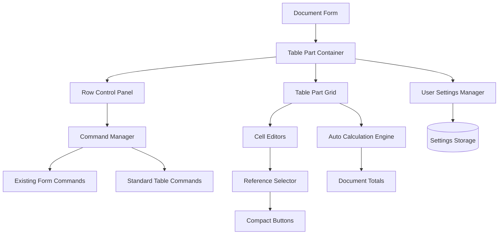
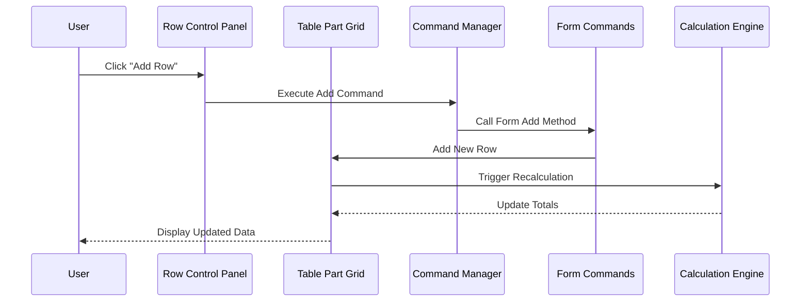

# Design Document: Document Table Parts

## Overview

This design document outlines the architecture and implementation approach for document table parts in the system. The design provides a unified, configurable interface for managing tabular data within document forms, with consistent user experience across desktop and web clients. The design emphasizes performance, usability, and adherence to platform conventions while integrating seamlessly with existing form commands.

## Architecture

### High-Level Architecture



### Component Interaction Flow



## Components and Interfaces

### 1. Row Control Panel

**Responsibilities:**
- Display row management buttons
- Handle button state management
- Integrate with existing form commands
- Provide customization interface

**Key Methods:**
```typescript
interface IRowControlPanel {
    initialize(config: PanelConfiguration): void;
    updateButtonStates(selection: RowSelection): void;
    executeCommand(commandId: string, context: CommandContext): Promise<void>;
    customizePanel(): void;
    saveSettings(settings: PanelSettings): Promise<void>;
}

interface PanelConfiguration {
    availableCommands: Command[];
    visibleCommands: string[];
    buttonLayout: ButtonLayout;
    shortcuts: ShortcutMapping[];
}
```

### 2. Table Part Grid

**Responsibilities:**
- Render tabular data
- Handle cell editing
- Manage row selection
- Support drag-and-drop operations
- Integrate with reference selectors

**Key Methods:**
```typescript
interface ITablePartGrid {
    loadData(data: TableRowData[]): void;
    addRow(position?: number): Promise<void>;
    deleteRows(rowIndices: number[]): Promise<void>;
    moveRows(rowIndices: number[], direction: MoveDirection): Promise<void>;
    handleCellEdit(row: number, column: string, value: any): Promise<void>;
    getSelectedRows(): number[];
    exportData(format: ExportFormat): Promise<ExportResult>;
}

interface TableRowData {
    id: string;
    cells: Record<string, CellValue>;
    metadata: RowMetadata;
}
```

### 3. Command Manager

**Responsibilities:**
- Coordinate between panel buttons and form commands
- Manage command availability and state
- Handle keyboard shortcuts
- Execute command chains

**Key Methods:**
```typescript
interface ICommandManager {
    registerFormCommands(commands: FormCommand[]): void;
    executeCommand(commandId: string, context: CommandContext): Promise<CommandResult>;
    updateCommandStates(context: TablePartContext): void;
    handleShortcut(shortcut: KeyboardShortcut): Promise<void>;
    getAvailableCommands(): Command[];
}

interface FormCommand {
    id: string;
    name: string;
    method: string;
    parameters?: any[];
    availability: CommandAvailability;
}
```

### 4. Reference Cell Editor

**Responsibilities:**
- Render reference fields with compact buttons
- Handle reference selection
- Manage auto-completion
- Fill related fields

**Key Methods:**
```typescript
interface IReferenceEditor {
    renderField(config: ReferenceFieldConfig): HTMLElement;
    openSelector(): Promise<ReferenceValue>;
    openElement(elementId: string): Promise<void>;
    handleAutoComplete(text: string): Promise<ReferenceValue[]>;
    fillRelatedFields(selectedValue: ReferenceValue): Promise<void>;
}

interface ReferenceFieldConfig {
    referenceType: string;
    currentValue?: ReferenceValue;
    relatedFields: string[];
    compactButtons: boolean;
}
```

## Data Models

### Core Data Structures

```typescript
interface TablePartDefinition {
    id: string;
    name: string;
    columns: ColumnDefinition[];
    commands: CommandDefinition[];
    settings: TablePartSettings;
}

interface ColumnDefinition {
    id: string;
    name: string;
    type: ColumnType;
    width?: number;
    editable: boolean;
    required: boolean;
    referenceType?: string;
    calculationFormula?: string;
}

interface CommandDefinition {
    id: string;
    name: string;
    icon: string;
    shortcut?: string;
    position: number;
    visible: boolean;
    enabled: boolean;
    formMethod?: string;
}

interface TablePartSettings {
    columnWidths: Record<string, number>;
    columnOrder: string[];
    hiddenColumns: string[];
    panelSettings: PanelSettings;
    shortcuts: ShortcutSettings;
}
```

### User Settings Schema

```typescript
interface UserTablePartSettings {
    userId: string;
    documentType: string;
    tablePartId: string;
    settings: TablePartSettings;
    lastModified: Date;
}

interface PanelSettings {
    visibleCommands: string[];
    hiddenCommands: string[];
    buttonSize: ButtonSize;
    showTooltips: boolean;
}

interface ShortcutSettings {
    enabled: boolean;
    customMappings: Record<string, string>;
}
```

## Data Models

### Database Schema for Settings Storage

```sql
-- Table part user settings
CREATE TABLE user_table_part_settings (
    id UUID PRIMARY KEY,
    user_id UUID NOT NULL,
    document_type VARCHAR(100) NOT NULL,
    table_part_id VARCHAR(100) NOT NULL,
    settings_data JSONB NOT NULL,
    created_at TIMESTAMP DEFAULT CURRENT_TIMESTAMP,
    updated_at TIMESTAMP DEFAULT CURRENT_TIMESTAMP,
    UNIQUE(user_id, document_type, table_part_id)
);

-- Command configuration for table parts
CREATE TABLE table_part_command_config (
    id UUID PRIMARY KEY,
    document_type VARCHAR(100) NOT NULL,
    table_part_id VARCHAR(100) NOT NULL,
    user_id UUID,
    command_id VARCHAR(100) NOT NULL,
    is_visible BOOLEAN DEFAULT true,
    position INTEGER,
    created_at TIMESTAMP DEFAULT CURRENT_TIMESTAMP,
    UNIQUE(document_type, table_part_id, user_id, command_id)
);

-- Indexes for fast retrieval
CREATE INDEX idx_table_part_settings ON user_table_part_settings(user_id, document_type, table_part_id);
CREATE INDEX idx_table_part_commands ON table_part_command_config(document_type, table_part_id, user_id);
```

## Correctness Properties

*A property is a characteristic or behavior that should hold true across all valid executions of a system—essentially, a formal statement about what the system should do. Properties serve as the bridge between human-readable specifications and machine-verifiable correctness guarantees.*

Based on the prework analysis, the following properties have been identified after eliminating redundancy:

### Property 1: Row Control Panel Button Presence
*For any* displayed row control panel, it should contain all required buttons: "Добавить", "Удалить", "Переместить выше", "Переместить ниже", "Импорт", "Экспорт", "Печать"
**Validates: Requirements 1.2**

### Property 2: Form Command Integration
*For any* document form with existing row commands, those commands should be integrated into the table part row control panel
**Validates: Requirements 2.1**

### Property 3: Table Part Keyboard Shortcuts
*For any* table part, the standard keyboard shortcuts (Insert, Delete, F4, Ctrl+C/Ctrl+V, Ctrl+Plus/Ctrl+Minus) should be functional
**Validates: Requirements 3.1**

### Property 4: Row Movement Shortcuts
*For any* table part with selected rows, Ctrl+Shift+Up should move rows up and Ctrl+Shift+Down should move rows down
**Validates: Requirements 3.2, 7.3, 7.4**

### Property 5: Hierarchical Navigation Shortcuts
*For any* hierarchical list form v2, navigation shortcuts (Ctrl+→/←, Home/End, Page Up/Down) should function correctly
**Validates: Requirements 4.1**

### Property 6: Automatic Sum Calculation on Quantity Change
*For any* quantity field change in a table part, the sum field should be recalculated as Quantity × Price within 100 milliseconds
**Validates: Requirements 8.1**

### Property 7: Automatic Sum Calculation on Price Change
*For any* price field change in a table part, the sum field should be recalculated as Quantity × Price within 100 milliseconds
**Validates: Requirements 8.2**

### Property 8: Reference Field Compact Buttons
*For any* reference type input field, it should contain a compact 'o' button and selector button positioned inside the field
**Validates: Requirements 11.1, 11.2**

### Property 9: Two-Column Layout for Multiple Fields
*For any* document form with 6 or more header input fields, they should be arranged in 2 columns
**Validates: Requirements 12.1**

### Property 10: Single Column Layout for Long Strings
*For any* input field containing long strings, it should remain in single column layout spanning the full form width
**Validates: Requirements 12.3**

## Error Handling

### Error Categories and Handling Strategies

1. **Command Execution Errors**
   - Form command not found or unavailable
   - Insufficient permissions for operation
   - Invalid row selection for command
   - **Strategy**: Disable buttons and show clear error messages

2. **Calculation Errors**
   - Invalid numeric values in calculation fields
   - Division by zero or overflow conditions
   - Missing required fields for calculation
   - **Strategy**: Show validation errors and prevent invalid operations

3. **Import/Export Errors**
   - Unsupported file formats
   - Data validation failures during import
   - File access permissions issues
   - **Strategy**: Progressive validation with detailed error reporting

4. **Reference Selection Errors**
   - Reference not found or deleted
   - Access restrictions to reference data
   - Network timeouts during reference loading
   - **Strategy**: Graceful fallback with retry mechanisms

### Error Recovery Mechanisms

```typescript
interface ErrorHandler {
    handleCommandError(error: CommandError): Promise<void>;
    handleCalculationError(error: CalculationError): Promise<void>;
    handleImportError(error: ImportError): Promise<ImportErrorResult>;
    handleReferenceError(error: ReferenceError): Promise<void>;
}

interface ImportErrorResult {
    successfulRows: number;
    failedRows: ImportErrorRow[];
    canRetry: boolean;
    suggestedActions: string[];
}
```

## Testing Strategy

### Dual Testing Approach

The testing strategy employs both unit testing and property-based testing to ensure comprehensive coverage:

- **Unit tests** verify specific examples, edge cases, and error conditions
- **Property tests** verify universal properties that should hold across all inputs
- Together they provide comprehensive coverage: unit tests catch concrete bugs, property tests verify general correctness

### Unit Testing Requirements

Unit tests will cover:
- Specific button click interactions and command executions
- Form layout scenarios with different field counts
- Reference field rendering with compact buttons
- Import/export dialog interactions
- Error handling scenarios

### Property-Based Testing Requirements

Property-based testing will use **Hypothesis** (for Python backend) and **fast-check** (for TypeScript frontend) libraries. Each property-based test will:
- Run a minimum of 100 iterations to ensure statistical confidence
- Be tagged with comments explicitly referencing the correctness property from this design document
- Use the exact format: '**Feature: document-table-parts, Property {number}: {property_text}**'
- Each correctness property will be implemented by a SINGLE property-based test

### Test Data Generation Strategy

Property tests will use smart generators that:
- Generate realistic table part configurations with various column types
- Create different document forms with varying field counts
- Simulate user interactions with different selection states
- Test boundary conditions (empty tables, maximum rows, etc.)

## Form Layout Implementation

### Two-Column Layout Logic

```typescript
interface FormLayoutManager {
    analyzeFields(fields: FormField[]): LayoutAnalysis;
    createTwoColumnLayout(fields: FormField[]): LayoutConfiguration;
    handleLongStringFields(fields: FormField[]): FormField[];
    adaptToWindowSize(layout: LayoutConfiguration, windowSize: WindowSize): void;
}

interface LayoutAnalysis {
    totalFields: number;
    longStringFields: FormField[];
    shortFields: FormField[];
    recommendedLayout: LayoutType;
}

interface LayoutConfiguration {
    leftColumn: FormField[];
    rightColumn: FormField[];
    fullWidthFields: FormField[];
    columnRatio: number;
}
```

### Field Classification Rules

1. **Long String Fields**: Text fields with maxLength > 100 or multiline fields
2. **Short Fields**: Numeric, date, boolean, and short text fields
3. **Reference Fields**: Fields with reference selectors and compact buttons
4. **Calculated Fields**: Read-only fields with automatic calculations

### Responsive Layout Behavior

```typescript
interface ResponsiveLayoutRules {
    // Minimum window width for 2-column layout
    minWidthForTwoColumns: number;
    
    // Field width ratios for different types
    fieldWidthRatios: {
        short: number;
        medium: number;
        long: number;
        reference: number;
    };
    
    // Breakpoints for layout adaptation
    breakpoints: {
        mobile: number;
        tablet: number;
        desktop: number;
    };
}
```

## Reference Field Implementation

### Compact Button Layout

```typescript
interface CompactButtonConfig {
    openButton: {
        text: 'o';
        position: 'right';
        size: 'small';
        tooltip: 'Open element';
    };
    
    selectorButton: {
        icon: '▼';
        position: 'right';
        size: 'small';
        tooltip: 'Select from list';
    };
    
    spacing: {
        betweenButtons: 2; // pixels
        fromFieldEdge: 4; // pixels
    };
}
```

### Reference Field Rendering

```css
.reference-field {
    position: relative;
    display: inline-block;
    width: 100%;
}

.reference-input {
    width: 100%;
    padding-right: 60px; /* Space for buttons */
    border: 1px solid #ccc;
    border-radius: 4px;
}

.compact-buttons {
    position: absolute;
    right: 4px;
    top: 50%;
    transform: translateY(-50%);
    display: flex;
    gap: 2px;
}

.compact-button {
    width: 24px;
    height: 24px;
    border: 1px solid #999;
    background: #f5f5f5;
    border-radius: 2px;
    font-size: 12px;
    cursor: pointer;
}
```

## Performance Considerations

### Calculation Engine Optimization

```typescript
interface CalculationOptimization {
    // Debounce rapid changes
    debounceDelay: 50; // milliseconds
    
    // Batch multiple calculations
    batchSize: 10;
    
    // Cache calculation results
    cacheEnabled: true;
    cacheTimeout: 5000; // milliseconds
    
    // Performance targets
    maxCalculationTime: 100; // milliseconds for single field
    maxTotalRecalculation: 200; // milliseconds for document totals
}
```

### Large Table Handling

```typescript
interface LargeTableStrategy {
    // Virtual scrolling threshold
    virtualScrollThreshold: 100;
    
    // Lazy loading configuration
    lazyLoadingEnabled: true;
    pageSize: 50;
    
    // Performance monitoring
    performanceMetrics: {
        renderTime: number;
        scrollPerformance: number;
        memoryUsage: number;
    };
}
```

This implementation ensures that:
1. All table parts have consistent row control panels with proper command integration
2. Keyboard shortcuts work uniformly across all table parts
3. Reference fields have compact, inline buttons for better space utilization
4. Form layouts adapt intelligently based on field count and types
5. Automatic calculations perform within specified time limits
6. The system maintains high performance even with large datasets

<function_calls>
<invoke name="prework">
<parameter name="featureName">document-table-parts

### tests run with --watchAll=false

npm test -- --watchAll=false