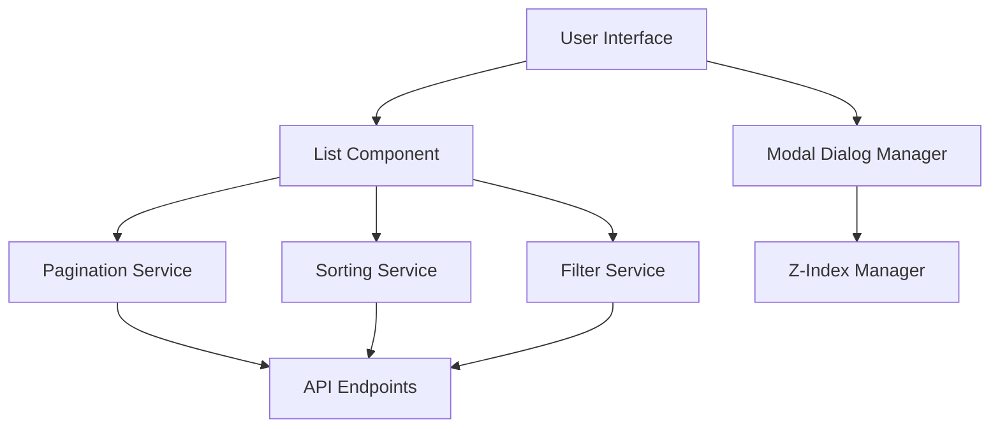

# Design Document - Modal Dialog and List Improvements

## Overview

This design addresses critical user interface issues in the construction time management system by implementing proper modal dialog layering, dynamic document list loading, and enhanced sorting capabilities. The solution focuses on improving user experience through better z-index management, infinite scrolling, intelligent date filtering, and column-based sorting.

## Architecture

The improvements will be implemented across three main layers:

1. **Desktop Application (PyQt6)** - Modal dialog z-index fixes and list improvements
2. **Web Client (Vue.js)** - Enhanced list components with dynamic loading
3. **API Layer** - Pagination and sorting endpoints

### Component Interaction Flow



## Components and Interfaces

### 1. Modal Dialog Management

#### Desktop (PyQt6) Components

**ModalDialogManager**
```python
class ModalDialogManager:
    def __init__(self):
        self.dialog_stack = []
        self.base_z_index = 1000
    
    def show_dialog(self, dialog, modal_type='modal'):
        # Manages z-index and stacking order
        pass
    
    def close_dialog(self, dialog):
        # Removes from stack and adjusts z-index
        pass
```

**Enhanced ReferencePickerDialog**
```python
class ReferencePickerDialog(QDialog):
    def __init__(self, modal_type='modal'):
        self.modal_type = modal_type  # 'modal' or 'non-modal'
        self.dialog_manager = ModalDialogManager.instance()
    
    def show_with_proper_z_index(self):
        # Uses dialog manager for proper layering
        pass
```

#### Web Client Components

**ModalService (TypeScript)**
```typescript
interface ModalConfig {
  id: string;
  component: Component;
  props?: Record<string, any>;
  zIndex?: number;
  modal?: boolean;
}

class ModalService {
  private modals: Map<string, ModalConfig> = new Map();
  private baseZIndex = 1000;
  
  show(config: ModalConfig): void;
  close(id: string): void;
  getTopZIndex(): number;
}
```

### 2. Dynamic List Loading

#### Enhanced List Components

**InfiniteScrollList (Vue.js)**
```typescript
interface ListConfig {
  pageSize: number;
  loadThreshold: number;
  virtualScrolling: boolean;
  sortable: boolean;
}

class InfiniteScrollList {
  private items: any[] = [];
  private loading = false;
  private hasMore = true;
  
  async loadMore(): Promise<void>;
  handleScroll(event: Event): void;
  sortByColumn(column: string): void;
}
```

**PaginationService**
```python
class PaginationService:
    def __init__(self, page_size=50):
        self.page_size = page_size
    
    def get_page(self, query, page=1, filters=None):
        # Returns paginated results with metadata
        pass
    
    def get_total_count(self, query, filters=None):
        # Returns total item count for pagination
        pass
```

### 3. Sorting and Filtering

**SortingService**
```python
class SortingService:
    def apply_sort(self, query, column, direction='asc'):
        # Applies sorting to database query
        pass
    
    def get_sortable_columns(self, table_name):
        # Returns list of sortable columns
        pass
```

**DateFilterService**
```python
class DateFilterService:
    def get_default_date_range(self, table_name):
        # Returns intelligent default date range
        pass
    
    def apply_date_filter(self, query, start_date, end_date):
        # Applies date filtering to query
        pass
```

## Data Models

### Modal Dialog State
```python
@dataclass
class DialogState:
    id: str
    z_index: int
    modal_type: str  # 'modal' or 'non-modal'
    parent_id: Optional[str]
    created_at: datetime
```

### Pagination Metadata
```python
@dataclass
class PaginationResult:
    items: List[Any]
    page: int
    page_size: int
    total_items: int
    total_pages: int
    has_next: bool
    has_previous: bool
```

### Sort Configuration
```python
@dataclass
class SortConfig:
    column: str
    direction: str  # 'asc' or 'desc'
    data_type: str  # 'string', 'number', 'date'
```

### Filter Configuration
```python
@dataclass
class FilterConfig:
    key: str
    value: Any
    operator: str  # 'equals', 'contains', 'between', etc.
```

## Correctness Properties

*A property is a characteristic or behavior that should hold true across all valid executions of a system-essentially, a formal statement about what the system should do. Properties serve as the bridge between human-readable specifications and machine-verifiable correctness guarantees.*

### Property 1: Modal Dialog Z-Index Monotonicity
*For any* sequence of modal dialog open operations, each newly opened dialog should have a z-index strictly greater than all previously opened dialogs
**Validates: Requirements 1.1, 1.2, 1.5**

### Property 2: Edit Form Visibility Over Selector
*For any* work selector dialog, when the edit button is clicked, the resulting work form should have a higher z-index than the selector and be fully visible
**Validates: Requirements 1.2, 1.3**

### Property 3: Focus Return After Dialog Close
*For any* modal dialog opened from another dialog, closing the child dialog should return focus to the parent dialog
**Validates: Requirements 1.4**

### Property 4: Dynamic Loading No Duplicates
*For any* document list with dynamic loading, loading multiple batches should never result in duplicate items in the displayed list
**Validates: Requirements 2.1, 2.2**

### Property 5: Scroll-Triggered Loading
*For any* document list with more items than the page size, scrolling to within the load threshold of the bottom should trigger loading of the next batch
**Validates: Requirements 2.2, 2.3**

### Property 6: Virtual Scrolling DOM Stability
*For any* document list with virtual scrolling enabled and any dataset size, the number of rendered DOM elements should remain constant and bounded
**Validates: Requirements 2.5**

### Property 7: Default Date Range Calculation
*For any* document list with at least one document, the default date filter should start from the most recent document's date (beginning of day) and extend to infinity
**Validates: Requirements 3.1**

### Property 8: Date Filter Application
*For any* date filter change, the document list should update to show only documents within the specified date range
**Validates: Requirements 3.2**

### Property 9: Date Filter Persistence
*For any* user-set custom date range, closing and reopening the document list should restore the user's custom date range
**Validates: Requirements 3.5**

### Property 10: Column Sort Toggle
*For any* sortable column, clicking the header should cycle through: ascending → descending → no sort, with each state properly reflected in the data order
**Validates: Requirements 4.1, 4.2**

### Property 11: Sort Visual Indicator Consistency
*For any* sorted column, a visual indicator should be present showing the current sort direction, and only one column should show a sort indicator at a time
**Validates: Requirements 4.3**

### Property 12: Global Sort with Pagination
*For any* document list with dynamic loading and sorting applied, the sort order should be maintained across all pages, not just the currently loaded items
**Validates: Requirements 4.4**

### Property 13: Non-Modal Window Independence
*For any* non-modal selector dialog, opening additional forms should not block interaction with the selector or other application windows
**Validates: Requirements 5.2, 5.3**

### Property 14: Multiple Non-Modal Windows
*For any* set of non-modal selector dialogs, each should operate independently without interfering with the others
**Validates: Requirements 5.4**

### Property 15: Modal Preference Persistence
*For any* user preference for modal vs non-modal behavior, the preference should be remembered and applied to future selector operations
**Validates: Requirements 5.5**

### Property 16: Keyboard Navigation Completeness
*For any* document list, all navigation operations (row selection, page navigation) should be achievable using only keyboard input
**Validates: Requirements 7.1**

### Property 17: Modal Focus Trapping
*For any* modal dialog, keyboard focus should remain within the dialog until it is closed, and Escape key should close the dialog
**Validates: Requirements 7.2**

### Property 18: Keyboard Sort Activation
*For any* sortable column header with keyboard focus, pressing Enter or Space should activate sorting
**Validates: Requirements 7.3**

### Property 19: Stacked Dialog Focus Management
*For any* sequence of stacked modal dialogs, keyboard focus should always be on the topmost dialog, and closing a dialog should return focus to the next dialog in the stack
**Validates: Requirements 7.5**

## Error Handling

### Modal Dialog Errors
- **Z-Index Conflicts**: Automatic resolution by recalculating stack order
- **Memory Leaks**: Proper cleanup when dialogs are closed
- **Focus Management**: Ensure focus returns to correct element

### List Loading Errors
- **Network Failures**: Retry mechanism with exponential backoff
- **Data Inconsistency**: Refresh and reload from last known good state
- **Performance Issues**: Fallback to simpler pagination if virtual scrolling fails

### Sorting/Filtering Errors
- **Invalid Sort Columns**: Graceful fallback to default sort
- **Filter Parsing Errors**: Clear invalid filters and show user message
- **Date Range Errors**: Reset to default date range

## Testing Strategy

### Unit Testing
- Modal dialog z-index calculations
- Pagination logic and boundary conditions
- Sort and filter parameter validation
- Date range calculation edge cases

### Property-Based Testing
The testing approach will use **Hypothesis** for Python components and **fast-check** for TypeScript components, configured to run a minimum of 100 iterations per property test.

Each property-based test will be tagged with comments explicitly referencing the correctness property:

**Property Test Examples:**
```python
# **Feature: modal-dialog-improvements, Property 1: Modal Dialog Stacking Order**
@given(st.lists(st.text(), min_size=1, max_size=10))
def test_modal_stacking_order(dialog_sequence):
    # Test that dialog z-index increases with each new dialog
    pass

# **Feature: modal-dialog-improvements, Property 2: Dynamic Loading Consistency**
@given(st.integers(min_value=1, max_value=1000), st.integers(min_value=10, max_value=100))
def test_dynamic_loading_no_duplicates(total_items, page_size):
    # Test that pagination never returns duplicate items
    pass
```

### Integration Testing
- End-to-end modal dialog workflows
- Complete list loading and sorting scenarios
- Cross-browser compatibility for web components
- Desktop and web client interaction testing

### Performance Testing
- Large dataset handling (10,000+ items)
- Memory usage during extended scrolling
- Modal dialog creation/destruction cycles
- Concurrent user scenarios

## Implementation Notes

### Desktop Application (PyQt6)
- Use `QDialog.setWindowFlags()` for proper modal behavior
- Implement custom z-index management through window stacking
- Leverage `QScrollArea` with custom scroll event handling for infinite scroll
- Use `QSortFilterProxyModel` for efficient sorting

### Web Client (Vue.js)
- Implement CSS `position: fixed` with calculated z-index values
- Use `Intersection Observer API` for scroll detection
- Leverage Vue's reactivity for efficient list updates
- Implement CSS Grid/Flexbox for responsive column layouts

### API Layer
- Add pagination parameters to all list endpoints
- Implement efficient database queries with LIMIT/OFFSET
- Use database indexes for commonly sorted columns
- Cache frequently accessed data for better performance

### Database Considerations
- Add indexes on commonly filtered date columns
- Optimize queries for large datasets
- Consider database-level pagination for very large tables
- Implement query result caching where appropriate