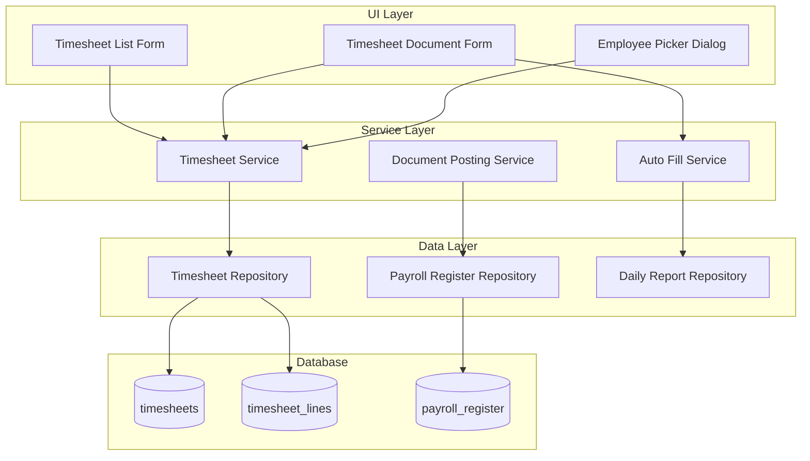

# Design Document - Timesheet (Табель)

## Overview

Документ "Табель" представляет собой систему учета рабочего времени сотрудников бригады за календарный месяц. Система включает:
- Документ с шапкой (номер, дата, объект, смета)
- Табличную часть с сотрудниками и отработанными часами по дням
- Регистр начислений и удержаний
- Механизм проведения с контролем уникальности
- Автозаполнение из ежедневных отчетов

## Architecture

### Component Diagram



## Components and Interfaces

### 1. Database Schema

#### Table: timesheets

```sql
CREATE TABLE timesheets (
    id INTEGER PRIMARY KEY AUTOINCREMENT,
    number TEXT NOT NULL,
    date DATE NOT NULL,
    object_id INTEGER REFERENCES objects(id),
    estimate_id INTEGER REFERENCES estimates(id),
    foreman_id INTEGER REFERENCES persons(id),
    month_year TEXT NOT NULL,  -- Format: "YYYY-MM"
    is_posted INTEGER DEFAULT 0,
    posted_at TIMESTAMP,
    marked_for_deletion INTEGER DEFAULT 0,
    created_at TIMESTAMP DEFAULT CURRENT_TIMESTAMP,
    modified_at TIMESTAMP DEFAULT CURRENT_TIMESTAMP
);

CREATE INDEX idx_timesheets_date ON timesheets(date);
CREATE INDEX idx_timesheets_foreman ON timesheets(foreman_id);
CREATE INDEX idx_timesheets_object ON timesheets(object_id);
CREATE INDEX idx_timesheets_estimate ON timesheets(estimate_id);
```

#### Table: timesheet_lines

```sql
CREATE TABLE timesheet_lines (
    id INTEGER PRIMARY KEY AUTOINCREMENT,
    timesheet_id INTEGER REFERENCES timesheets(id) ON DELETE CASCADE,
    line_number INTEGER,
    employee_id INTEGER REFERENCES persons(id),
    hourly_rate REAL DEFAULT 0,
    -- Days 1-31
    day_01 REAL DEFAULT 0,
    day_02 REAL DEFAULT 0,
    day_03 REAL DEFAULT 0,
    day_04 REAL DEFAULT 0,
    day_05 REAL DEFAULT 0,
    day_06 REAL DEFAULT 0,
    day_07 REAL DEFAULT 0,
    day_08 REAL DEFAULT 0,
    day_09 REAL DEFAULT 0,
    day_10 REAL DEFAULT 0,
    day_11 REAL DEFAULT 0,
    day_12 REAL DEFAULT 0,
    day_13 REAL DEFAULT 0,
    day_14 REAL DEFAULT 0,
    day_15 REAL DEFAULT 0,
    day_16 REAL DEFAULT 0,
    day_17 REAL DEFAULT 0,
    day_18 REAL DEFAULT 0,
    day_19 REAL DEFAULT 0,
    day_20 REAL DEFAULT 0,
    day_21 REAL DEFAULT 0,
    day_22 REAL DEFAULT 0,
    day_23 REAL DEFAULT 0,
    day_24 REAL DEFAULT 0,
    day_25 REAL DEFAULT 0,
    day_26 REAL DEFAULT 0,
    day_27 REAL DEFAULT 0,
    day_28 REAL DEFAULT 0,
    day_29 REAL DEFAULT 0,
    day_30 REAL DEFAULT 0,
    day_31 REAL DEFAULT 0,
    -- Calculated fields
    total_hours REAL DEFAULT 0,
    total_amount REAL DEFAULT 0
);

CREATE INDEX idx_timesheet_lines_timesheet ON timesheet_lines(timesheet_id);
CREATE INDEX idx_timesheet_lines_employee ON timesheet_lines(employee_id);
```

#### Table: payroll_register

```sql
CREATE TABLE payroll_register (
    id INTEGER PRIMARY KEY AUTOINCREMENT,
    recorder_type TEXT NOT NULL,  -- 'timesheet'
    recorder_id INTEGER NOT NULL,
    line_number INTEGER NOT NULL,
    period DATE NOT NULL,
    object_id INTEGER REFERENCES objects(id),
    estimate_id INTEGER REFERENCES estimates(id),
    employee_id INTEGER REFERENCES persons(id),
    work_date DATE NOT NULL,
    hours_worked REAL DEFAULT 0,
    amount REAL DEFAULT 0,
    created_at TIMESTAMP DEFAULT CURRENT_TIMESTAMP,
    UNIQUE(object_id, estimate_id, employee_id, work_date)
);

CREATE INDEX idx_payroll_recorder ON payroll_register(recorder_type, recorder_id);
CREATE INDEX idx_payroll_dimensions ON payroll_register(period, object_id, estimate_id, employee_id);
CREATE INDEX idx_payroll_date ON payroll_register(work_date);
```

### 2. Data Models

#### Pydantic Models (API)

```python
from pydantic import BaseModel, Field
from typing import Optional, List, Dict
from datetime import date, datetime

class TimesheetLineBase(BaseModel):
    line_number: int = Field(..., ge=1)
    employee_id: int
    hourly_rate: float = Field(default=0, ge=0)
    # Days dictionary: {1: 8.0, 2: 7.5, ...}
    days: Dict[int, float] = Field(default_factory=dict)
    
class TimesheetLineCreate(TimesheetLineBase):
    pass

class TimesheetLine(TimesheetLineBase):
    id: int
    timesheet_id: int
    total_hours: float = 0
    total_amount: float = 0
    employee_name: Optional[str] = None
    
    class Config:
        from_attributes = True

class TimesheetBase(BaseModel):
    number: str = Field(..., min_length=1, max_length=100)
    date: date
    object_id: Optional[int] = None
    estimate_id: Optional[int] = None
    foreman_id: Optional[int] = None
    month_year: str  # "YYYY-MM"

class TimesheetCreate(TimesheetBase):
    lines: List[TimesheetLineCreate] = []

class TimesheetUpdate(TimesheetBase):
    lines: Optional[List[TimesheetLineCreate]] = None

class Timesheet(TimesheetBase):
    id: int
    is_posted: bool = False
    posted_at: Optional[datetime] = None
    marked_for_deletion: bool = False
    created_at: datetime
    modified_at: datetime
    lines: List[TimesheetLine] = []
    
    # Joined fields
    object_name: Optional[str] = None
    estimate_number: Optional[str] = None
    foreman_name: Optional[str] = None
    
    class Config:
        from_attributes = True
```

### 3. Repository Layer

#### TimesheetRepository

```python
class TimesheetRepository:
    def __init__(self, db_manager: DatabaseManager):
        self.db = db_manager
    
    def find_all(self, foreman_id: Optional[int] = None) -> List[Timesheet]:
        """Get all timesheets, optionally filtered by foreman"""
        pass
    
    def find_by_id(self, timesheet_id: int) -> Optional[Timesheet]:
        """Get timesheet by ID with lines"""
        pass
    
    def create(self, timesheet: TimesheetCreate, foreman_id: int) -> Timesheet:
        """Create new timesheet"""
        pass
    
    def update(self, timesheet_id: int, timesheet: TimesheetUpdate) -> Timesheet:
        """Update existing timesheet"""
        pass
    
    def delete(self, timesheet_id: int) -> bool:
        """Delete timesheet (soft delete)"""
        pass
    
    def mark_posted(self, timesheet_id: int) -> bool:
        """Mark timesheet as posted"""
        pass
    
    def unmark_posted(self, timesheet_id: int) -> bool:
        """Unmark timesheet as posted"""
        pass
```

#### PayrollRegisterRepository

```python
class PayrollRegisterRepository:
    def __init__(self, db_manager: DatabaseManager):
        self.db = db_manager
    
    def write_records(self, records: List[PayrollRecord]) -> bool:
        """Write records to register with uniqueness check"""
        pass
    
    def delete_by_recorder(self, recorder_type: str, recorder_id: int) -> bool:
        """Delete all records by recorder"""
        pass
    
    def check_duplicates(self, records: List[PayrollRecord]) -> List[PayrollRecord]:
        """Check for duplicate records"""
        pass
    
    def get_by_dimensions(
        self, 
        object_id: int, 
        estimate_id: int, 
        employee_id: int, 
        work_date: date
    ) -> Optional[PayrollRecord]:
        """Get record by unique key"""
        pass
```

### 4. Service Layer

#### TimesheetService

```python
class TimesheetService:
    def __init__(
        self, 
        timesheet_repo: TimesheetRepository,
        person_repo: ReferenceRepository
    ):
        self.timesheet_repo = timesheet_repo
        self.person_repo = person_repo
    
    def get_timesheets(self, user_id: int, role: str) -> List[Timesheet]:
        """Get timesheets based on user role"""
        if role == 'admin':
            return self.timesheet_repo.find_all()
        else:
            # Get foreman's person_id
            person = self.person_repo.find_by_user_id(user_id)
            return self.timesheet_repo.find_all(foreman_id=person.id)
    
    def create_timesheet(
        self, 
        timesheet_data: TimesheetCreate, 
        user_id: int
    ) -> Timesheet:
        """Create new timesheet"""
        person = self.person_repo.find_by_user_id(user_id)
        return self.timesheet_repo.create(timesheet_data, person.id)
    
    def update_timesheet(
        self, 
        timesheet_id: int, 
        timesheet_data: TimesheetUpdate
    ) -> Timesheet:
        """Update timesheet"""
        self._recalculate_totals(timesheet_data)
        return self.timesheet_repo.update(timesheet_id, timesheet_data)
    
    def _recalculate_totals(self, timesheet_data: TimesheetUpdate):
        """Recalculate total hours and amount for each line"""
        for line in timesheet_data.lines:
            line.total_hours = sum(line.days.values())
            line.total_amount = line.total_hours * line.hourly_rate
```

#### TimesheetPostingService

```python
class TimesheetPostingService:
    def __init__(
        self,
        timesheet_repo: TimesheetRepository,
        payroll_repo: PayrollRegisterRepository
    ):
        self.timesheet_repo = timesheet_repo
        self.payroll_repo = payroll_repo
    
    def post_timesheet(self, timesheet_id: int) -> Tuple[bool, str]:
        """Post timesheet and create payroll records"""
        timesheet = self.timesheet_repo.find_by_id(timesheet_id)
        
        if timesheet.is_posted:
            return False, "Timesheet is already posted"
        
        # Create payroll records
        records = self._create_payroll_records(timesheet)
        
        # Check for duplicates
        duplicates = self.payroll_repo.check_duplicates(records)
        if duplicates:
            return False, f"Duplicate records found: {duplicates}"
        
        # Write records
        try:
            self.payroll_repo.write_records(records)
            self.timesheet_repo.mark_posted(timesheet_id)
            return True, "Timesheet posted successfully"
        except Exception as e:
            return False, f"Error posting timesheet: {str(e)}"
    
    def unpost_timesheet(self, timesheet_id: int) -> Tuple[bool, str]:
        """Unpost timesheet and delete payroll records"""
        try:
            self.payroll_repo.delete_by_recorder('timesheet', timesheet_id)
            self.timesheet_repo.unmark_posted(timesheet_id)
            return True, "Timesheet unposted successfully"
        except Exception as e:
            return False, f"Error unposting timesheet: {str(e)}"
    
    def _create_payroll_records(self, timesheet: Timesheet) -> List[PayrollRecord]:
        """Create payroll records from timesheet lines"""
        records = []
        year, month = map(int, timesheet.month_year.split('-'))
        
        for line in timesheet.lines:
            for day, hours in line.days.items():
                if hours > 0:
                    work_date = date(year, month, day)
                    amount = hours * line.hourly_rate
                    
                    record = PayrollRecord(
                        recorder_type='timesheet',
                        recorder_id=timesheet.id,
                        line_number=line.line_number,
                        period=work_date,
                        object_id=timesheet.object_id,
                        estimate_id=timesheet.estimate_id,
                        employee_id=line.employee_id,
                        work_date=work_date,
                        hours_worked=hours,
                        amount=amount
                    )
                    records.append(record)
        
        return records
```


#### AutoFillService

```python
class AutoFillService:
    def __init__(
        self,
        daily_report_repo: DailyReportRepository,
        person_repo: ReferenceRepository
    ):
        self.daily_report_repo = daily_report_repo
        self.person_repo = person_repo
    
    def fill_from_daily_reports(
        self,
        object_id: int,
        estimate_id: int,
        month_year: str
    ) -> List[TimesheetLineCreate]:
        """Fill timesheet lines from daily reports"""
        year, month = map(int, month_year.split('-'))
        start_date = date(year, month, 1)
        
        # Calculate last day of month
        if month == 12:
            end_date = date(year + 1, 1, 1) - timedelta(days=1)
        else:
            end_date = date(year, month + 1, 1) - timedelta(days=1)
        
        # Get daily reports for period
        reports = self.daily_report_repo.find_by_period(
            object_id=object_id,
            estimate_id=estimate_id,
            start_date=start_date,
            end_date=end_date
        )
        
        # Aggregate hours by employee and day
        employee_hours = {}  # {employee_id: {day: hours}}
        
        for report in reports:
            day = report.date.day
            for line in report.lines:
                if line.executor_ids:
                    # Distribute hours among executors
                    hours_per_executor = line.actual_labor / len(line.executor_ids)
                    for executor_id in line.executor_ids:
                        if executor_id not in employee_hours:
                            employee_hours[executor_id] = {}
                        if day not in employee_hours[executor_id]:
                            employee_hours[executor_id][day] = 0
                        employee_hours[executor_id][day] += hours_per_executor
        
        # Create timesheet lines
        lines = []
        for line_number, (employee_id, days) in enumerate(employee_hours.items(), 1):
            person = self.person_repo.find_by_id(employee_id)
            hourly_rate = person.hourly_rate if hasattr(person, 'hourly_rate') else 0
            
            line = TimesheetLineCreate(
                line_number=line_number,
                employee_id=employee_id,
                hourly_rate=hourly_rate,
                days=days
            )
            lines.append(line)
        
        return lines
```

### 5. UI Components

#### Timesheet List Form (PyQt6)

```python
class TimesheetListForm(QWidget):
    def __init__(self, timesheet_service: TimesheetService, user_id: int, role: str):
        super().__init__()
        self.timesheet_service = timesheet_service
        self.user_id = user_id
        self.role = role
        self.setup_ui()
        self.load_data()
    
    def setup_ui(self):
        """Setup UI with table, toolbar, filters"""
        # Table columns: Number, Date, Object, Estimate, Foreman, Posted
        # Toolbar: New, Edit, Delete, Post, Unpost, Print
        # Filters: Date range, Object, Posted status
        pass
    
    def load_data(self):
        """Load timesheets based on user role"""
        timesheets = self.timesheet_service.get_timesheets(self.user_id, self.role)
        self.populate_table(timesheets)
```

#### Timesheet Document Form (PyQt6)

```python
class TimesheetDocumentForm(QDialog):
    def __init__(
        self, 
        timesheet_service: TimesheetService,
        auto_fill_service: AutoFillService,
        timesheet_id: Optional[int] = None
    ):
        super().__init__()
        self.timesheet_service = timesheet_service
        self.auto_fill_service = auto_fill_service
        self.timesheet_id = timesheet_id
        self.setup_ui()
        if timesheet_id:
            self.load_timesheet()
    
    def setup_ui(self):
        """Setup UI with header fields and tabular section"""
        # Header: Number, Date, Object, Estimate
        # Toolbar: Save, Post, Unpost, Print, Fill from Daily Reports
        # Table: Employee, Rate, Day 1-31, Total, Amount
        # Table should support:
        # - Dynamic column count based on month
        # - Weekend highlighting
        # - Auto-calculation of totals
        # - Cell navigation with Tab/Enter
        pass
    
    def fill_from_daily_reports(self):
        """Fill tabular section from daily reports"""
        if not self.object_id or not self.estimate_id:
            QMessageBox.warning(self, "Warning", "Please select Object and Estimate first")
            return
        
        if self.table.rowCount() > 0:
            reply = QMessageBox.question(
                self,
                "Confirm",
                "Table already contains data. Replace it?",
                QMessageBox.Yes | QMessageBox.No
            )
            if reply == QMessageBox.No:
                return
        
        month_year = self.date_edit.date().toString("yyyy-MM")
        lines = self.auto_fill_service.fill_from_daily_reports(
            self.object_id,
            self.estimate_id,
            month_year
        )
        
        self.populate_table(lines)
    
    def on_cell_changed(self, row: int, col: int):
        """Recalculate totals when cell value changes"""
        if col >= 2 and col <= 32:  # Day columns
            self.recalculate_row_totals(row)
    
    def recalculate_row_totals(self, row: int):
        """Recalculate total hours and amount for row"""
        total_hours = 0
        for col in range(2, 33):  # Day columns
            value = self.table.item(row, col)
            if value:
                try:
                    hours = float(value.text())
                    total_hours += hours
                except ValueError:
                    pass
        
        rate_item = self.table.item(row, 1)
        if rate_item:
            try:
                rate = float(rate_item.text())
                total_amount = total_hours * rate
                
                # Update total columns
                self.table.setItem(row, 33, QTableWidgetItem(str(total_hours)))
                self.table.setItem(row, 34, QTableWidgetItem(f"{total_amount:.2f}"))
            except ValueError:
                pass
```

#### Employee Picker Dialog with Brigade Filter

```python
class EmployeePickerDialog(QDialog):
    def __init__(
        self,
        person_repo: ReferenceRepository,
        foreman_id: int,
        show_all: bool = False
    ):
        super().__init__()
        self.person_repo = person_repo
        self.foreman_id = foreman_id
        self.show_all = show_all
        self.setup_ui()
        self.load_employees()
    
    def setup_ui(self):
        """Setup UI with employee list and filter checkbox"""
        # Checkbox: "Show all employees" / "Show only my brigade"
        # Table: Name, Position, Rate
        # Buttons: OK, Cancel
        pass
    
    def load_employees(self):
        """Load employees based on filter"""
        if self.show_all:
            employees = self.person_repo.find_all()
        else:
            # Get employees where foreman is supervisor or no supervisor
            employees = self.person_repo.find_by_supervisor(
                supervisor_id=self.foreman_id,
                include_free=True
            )
        
        self.populate_table(employees)
```

### 6. API Endpoints

```python
from fastapi import APIRouter, Depends, HTTPException
from typing import List

router = APIRouter(prefix="/api/documents/timesheets", tags=["timesheets"])

@router.get("/", response_model=List[Timesheet])
async def get_timesheets(
    current_user: User = Depends(get_current_user),
    timesheet_service: TimesheetService = Depends()
):
    """Get all timesheets for current user"""
    return timesheet_service.get_timesheets(current_user.id, current_user.role)

@router.get("/{timesheet_id}", response_model=Timesheet)
async def get_timesheet(
    timesheet_id: int,
    timesheet_service: TimesheetService = Depends()
):
    """Get timesheet by ID"""
    timesheet = timesheet_service.get_by_id(timesheet_id)
    if not timesheet:
        raise HTTPException(status_code=404, detail="Timesheet not found")
    return timesheet

@router.post("/", response_model=Timesheet)
async def create_timesheet(
    timesheet: TimesheetCreate,
    current_user: User = Depends(get_current_user),
    timesheet_service: TimesheetService = Depends()
):
    """Create new timesheet"""
    return timesheet_service.create_timesheet(timesheet, current_user.id)

@router.put("/{timesheet_id}", response_model=Timesheet)
async def update_timesheet(
    timesheet_id: int,
    timesheet: TimesheetUpdate,
    timesheet_service: TimesheetService = Depends()
):
    """Update timesheet"""
    return timesheet_service.update_timesheet(timesheet_id, timesheet)

@router.post("/{timesheet_id}/post")
async def post_timesheet(
    timesheet_id: int,
    posting_service: TimesheetPostingService = Depends()
):
    """Post timesheet"""
    success, message = posting_service.post_timesheet(timesheet_id)
    if not success:
        raise HTTPException(status_code=400, detail=message)
    return {"success": True, "message": message}

@router.post("/{timesheet_id}/unpost")
async def unpost_timesheet(
    timesheet_id: int,
    posting_service: TimesheetPostingService = Depends()
):
    """Unpost timesheet"""
    success, message = posting_service.unpost_timesheet(timesheet_id)
    if not success:
        raise HTTPException(status_code=400, detail=message)
    return {"success": True, "message": message}

@router.post("/autofill")
async def autofill_from_daily_reports(
    object_id: int,
    estimate_id: int,
    month_year: str,
    auto_fill_service: AutoFillService = Depends()
):
    """Get timesheet lines from daily reports"""
    lines = auto_fill_service.fill_from_daily_reports(
        object_id, estimate_id, month_year
    )
    return {"lines": lines}
```

## Data Models

### Timesheet Document Structure

```
Timesheet
├── Header
│   ├── number: string
│   ├── date: date
│   ├── object_id: int (FK -> objects)
│   ├── estimate_id: int (FK -> estimates)
│   ├── foreman_id: int (FK -> persons)
│   ├── month_year: string ("YYYY-MM")
│   ├── is_posted: boolean
│   └── posted_at: datetime
└── Lines []
    ├── line_number: int
    ├── employee_id: int (FK -> persons)
    ├── hourly_rate: float
    ├── day_01 to day_31: float
    ├── total_hours: float (calculated)
    └── total_amount: float (calculated)
```

### Payroll Register Structure

```
PayrollRecord
├── recorder_type: "timesheet"
├── recorder_id: int (FK -> timesheets)
├── line_number: int
├── period: date
├── object_id: int (FK -> objects)
├── estimate_id: int (FK -> estimates)
├── employee_id: int (FK -> persons)
├── work_date: date
├── hours_worked: float
└── amount: float

UNIQUE KEY: (object_id, estimate_id, employee_id, work_date)
```

## Error Handling

### Posting Errors

1. **Duplicate Record Error**
   - Check: Before writing to payroll_register
   - Action: Rollback transaction, show error with conflicting records
   - Message: "Cannot post: duplicate records found for [Employee] on [Date]"

2. **Empty Timesheet Error**
   - Check: Before posting
   - Action: Prevent posting
   - Message: "Cannot post: timesheet has no working hours"

3. **Invalid Hours Error**
   - Check: On cell value change
   - Action: Reject input
   - Message: "Hours must be between 0 and 24"

4. **Missing Required Fields**
   - Check: On save/post
   - Action: Prevent operation
   - Message: "Please fill required fields: Object, Estimate"

## Testing Strategy

### Unit Tests

1. **TimesheetService Tests**
   - Create timesheet
   - Update timesheet
   - Calculate totals
   - Filter by foreman

2. **PostingService Tests**
   - Post timesheet
   - Unpost timesheet
   - Duplicate detection
   - Record creation

3. **AutoFillService Tests**
   - Fill from daily reports
   - Hour distribution
   - Empty result handling

### Integration Tests

1. **End-to-End Posting**
   - Create timesheet → Fill data → Post → Verify register records

2. **Duplicate Prevention**
   - Create timesheet → Post → Create another → Post → Verify error

3. **Unposting**
   - Post timesheet → Unpost → Verify register cleanup

### UI Tests

1. **Form Validation**
   - Test hour input limits
   - Test required fields
   - Test calculation accuracy

2. **Auto-fill**
   - Test with daily reports
   - Test with empty data
   - Test confirmation dialog

## Performance Considerations

1. **Database Indexes**
   - Index on (object_id, estimate_id, employee_id, work_date) for fast duplicate checks
   - Index on foreman_id for filtering
   - Index on date for period queries

2. **Batch Operations**
   - Insert payroll records in batch transaction
   - Use prepared statements for bulk inserts

3. **UI Optimization**
   - Lazy load timesheet lines
   - Cache employee list
   - Debounce cell value changes

## Security

1. **Access Control**
   - Foreman can only view/edit own timesheets
   - Admin can view/edit all timesheets
   - Check permissions on all operations

2. **Data Validation**
   - Validate hour ranges (0-24)
   - Validate positive rates
   - Sanitize all inputs

3. **Audit Trail**
   - Log all posting/unposting operations
   - Track who created/modified timesheet
   - Store timestamps for all changes
