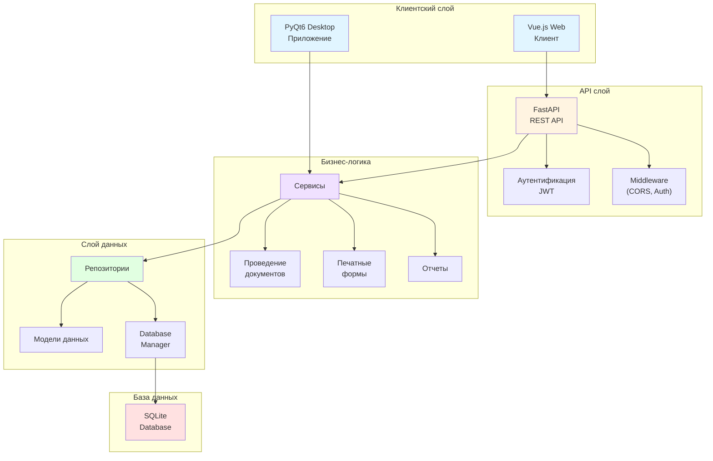
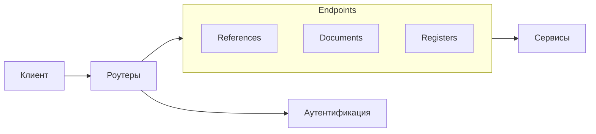
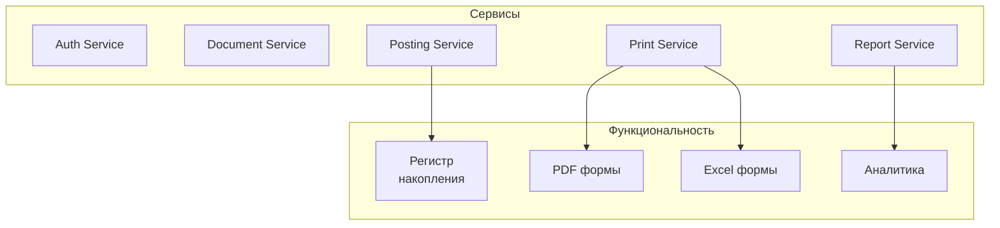
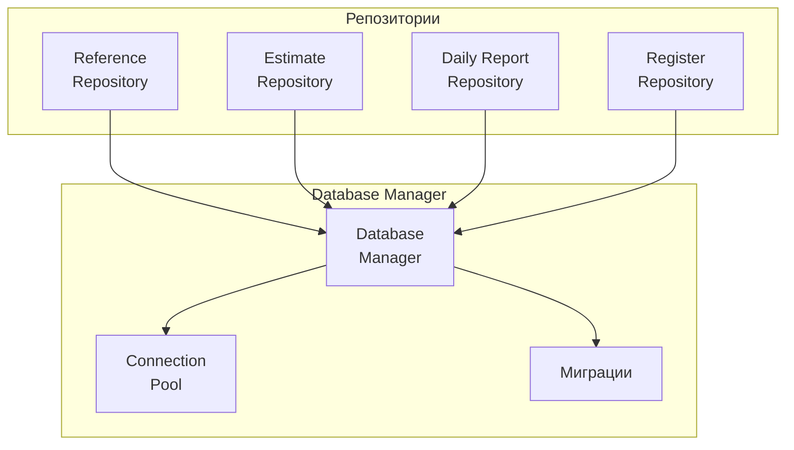
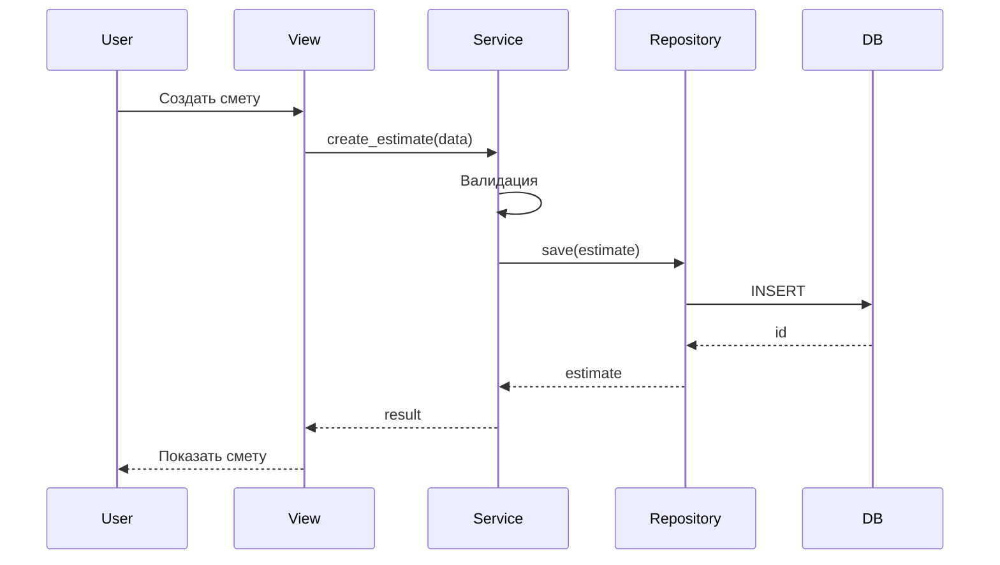
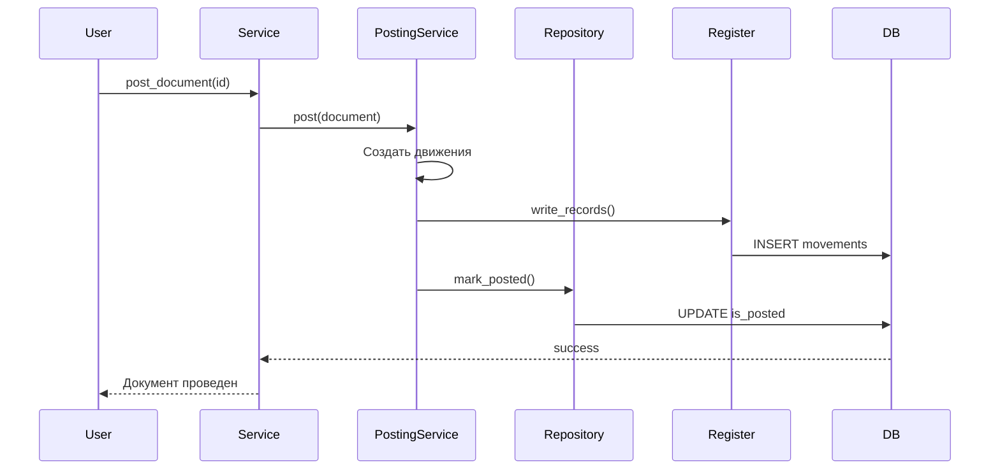
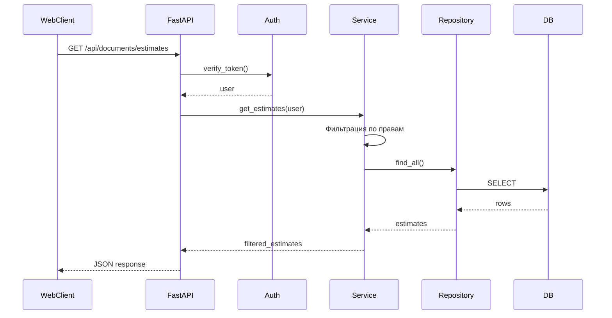
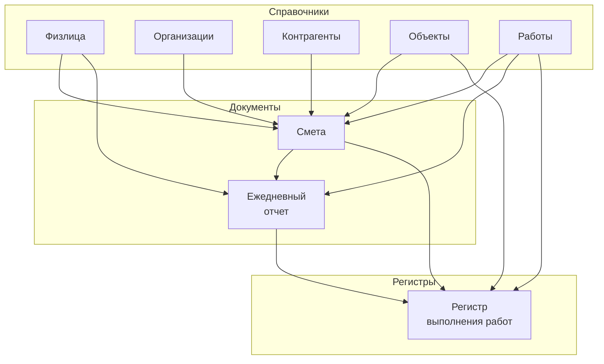
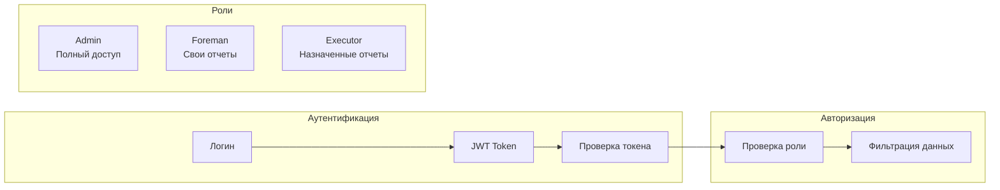
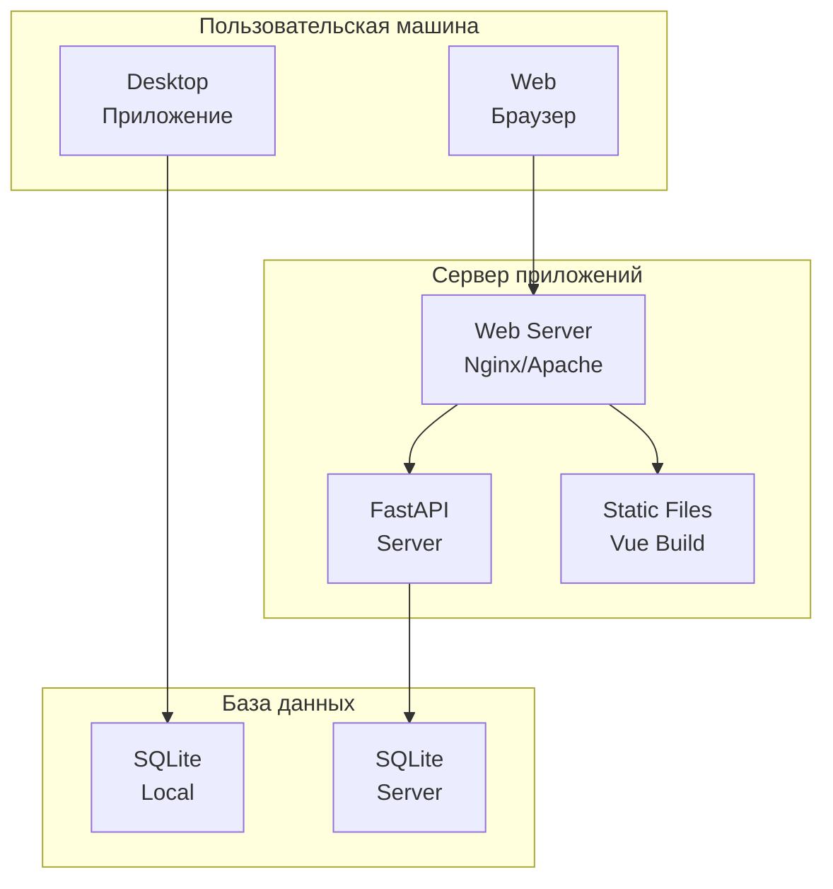

# Архитектура системы

## Обзор

Система управления строительством построена на многоуровневой архитектуре с разделением на слои данных, бизнес-логики и представления.

## Архитектурная диаграмма

## Компоненты системы

### 1. Клиентский слой

#### PyQt6 Desktop приложение
- Нативное десктопное приложение на Python
- Использует PyQt6 для UI
- Прямой доступ к бизнес-логике через сервисы
- Поддержка горячих клавиш в стиле 1С

#### Vue.js Web клиент
- SPA приложение на Vue 3 + TypeScript
- Использует Tailwind CSS для стилизации
- Взаимодействует с backend через REST API
- Адаптивный дизайн

### 2. API слой (FastAPI)

Основные эндпоинты:
- `/api/auth/*` - аутентификация и авторизация
- `/api/references/*` - справочники
- `/api/documents/*` - документы (сметы, отчеты)
- `/api/registers/*` - регистры

### 3. Бизнес-логика

#### Ключевые сервисы:

1. **AuthService** - управление пользователями и правами доступа
2. **DocumentPostingService** - проведение документов
3. **PrintFormService** - генерация печатных форм
4. **ExcelImportService** - импорт из Excel
5. **DailyReportService** - работа с ежедневными отчетами

### 4. Слой данных

## Поток данных

### Создание документа (Desktop)

### Проведение документа

### API запрос (Web)

## Модель данных

### Иерархия сущностей

## Паттерны проектирования

### 1. Repository Pattern
Абстракция доступа к данным через репозитории

### 2. Service Layer
Бизнес-логика инкапсулирована в сервисах

### 3. Singleton
DatabaseManager использует паттерн Singleton

### 4. Factory
Создание печатных форм через фабрику

### 5. Strategy
Различные стратегии печати (PDF, Excel)

## Безопасность

### Уровни доступа:

1. **Admin** - полный доступ ко всем данным
2. **Foreman** - доступ к своим ежедневным отчетам
3. **Executor** - доступ к отчетам, где назначен исполнителем

## Масштабируемость

### Текущая архитектура
- Однопользовательская SQLite база (Desktop)
- Многопользовательский API (Web)

### Возможности расширения
- Миграция на PostgreSQL/MySQL
- Кэширование (Redis)
- Очереди задач (Celery)
- Микросервисная архитектура

## Технологический стек

### Backend
- Python 3.8+
- FastAPI (Web API)
- PyQt6 (Desktop UI)
- SQLite (Database)
- Pydantic (Validation)
- JWT (Authentication)

### Frontend
- Vue 3 (Framework)
- TypeScript (Language)
- Tailwind CSS (Styling)
- Vite (Build tool)

### Печатные формы
- ReportLab (PDF)
- OpenPyXL (Excel)

## Диаграмма развертывания

## Производительность

### Оптимизации:
- Индексы на часто используемых полях
- Ленивая загрузка связанных данных
- Пагинация списков
- Кэширование справочников
- Batch операции для массовых изменений

### Метрики:
- Время загрузки списка документов: < 100ms
- Время создания документа: < 50ms
- Время проведения документа: < 200ms
- Время генерации печатной формы: < 1s
