# Диаграмма связей и типов данных

## Обзор структуры базы данных

Система управления строительством использует SQLite базу данных со следующими основными сущностями:

## ER-диаграмма (Entity-Relationship Diagram)

```mermaid
erDiagram
    users ||--o{ persons : "связан с"
    users ||--o{ user_settings : "имеет"
    
    persons ||--o{ persons : "иерархия"
    persons ||--o{ organizations : "ответственный"
    persons ||--o{ estimates : "ответственный"
    persons ||--o{ daily_reports : "прораб"
    persons ||--o{ daily_report_executors : "исполнитель"
    
    organizations ||--o{ organizations : "иерархия"
    organizations ||--o{ estimates : "подрядчик"
    
    counterparties ||--o{ counterparties : "иерархия"
    counterparties ||--o{ estimates : "заказчик"
    counterparties ||--o{ objects : "владелец"
    
    objects ||--o{ objects : "иерархия"
    objects ||--o{ estimates : "объект"
    objects ||--o{ work_execution_register : "объект"
    
    works ||--o{ works : "иерархия"
    works ||--o{ estimate_lines : "работа"
    works ||--o{ daily_report_lines : "работа"
    works ||--o{ work_execution_register : "работа"
    
    estimates ||--|{ estimate_lines : "содержит"
    estimates ||--o{ daily_reports : "связан"
    estimates ||--o{ work_execution_register : "смета"
    
    estimate_lines ||--o{ estimate_lines : "группировка"
    
    daily_reports ||--|{ daily_report_lines : "содержит"
    daily_reports ||--o{ work_execution_register : "регистратор"
    
    daily_report_lines ||--o{ daily_report_lines : "группировка"
    daily_report_lines ||--o{ daily_report_executors : "исполнители"
    
    timesheets ||--|{ timesheet_lines : "содержит"
    timesheets ||--o{ payroll_register : "регистратор"
    timesheets ||--o{ objects : "объект"
    timesheets ||--o{ estimates : "смета"
    timesheets ||--o{ persons : "бригадир"
    
    timesheet_lines ||--o{ persons : "сотрудник"
    
    users {
        int id PK
        string username UK
        string password_hash
        string role
        bool is_active
    }
    
    persons {
        int id PK
        string full_name
        string position
        string phone
        int user_id FK
        int parent_id FK
        bool marked_for_deletion
        bool is_group
    }
    
    organizations {
        int id PK
        string name
        string inn
        int default_responsible_id FK
        int parent_id FK
        bool marked_for_deletion
        bool is_group
    }
    
    counterparties {
        int id PK
        string name
        string inn
        string contact_person
        string phone
        int parent_id FK
        bool marked_for_deletion
        bool is_group
    }
    
    objects {
        int id PK
        string name
        string address
        int owner_id FK
        int parent_id FK
        bool marked_for_deletion
        bool is_group
    }
    
    works {
        int id PK
        string name
        string code
        string unit
        float price
        float labor_rate
        int parent_id FK
        bool marked_for_deletion
        bool is_group
    }
    
    estimates {
        int id PK
        string number
        date date
        int customer_id FK
        int object_id FK
        int contractor_id FK
        int responsible_id FK
        float total_sum
        float total_labor
        bool is_posted
        datetime posted_at
        bool marked_for_deletion
        datetime created_at
        datetime modified_at
    }
    
    estimate_lines {
        int id PK
        int estimate_id FK
        int line_number
        int work_id FK
        float quantity
        string unit
        float price
        float labor_rate
        float sum
        float planned_labor
        bool is_group
        string group_name
        int parent_group_id FK
        bool is_collapsed
    }
    
    daily_reports {
        int id PK
        string number
        date date
        int estimate_id FK
        int foreman_id FK
        bool is_posted
        datetime posted_at
        bool marked_for_deletion
        datetime created_at
        datetime modified_at
    }
    
    daily_report_lines {
        int id PK
        int report_id FK
        int line_number
        int work_id FK
        float planned_labor
        float actual_labor
        float deviation_percent
        bool is_group
        string group_name
        int parent_group_id FK
        bool is_collapsed
    }
    
    daily_report_executors {
        int report_line_id FK
        int executor_id FK
    }
    
    work_execution_register {
        int id PK
        string recorder_type
        int recorder_id
        int line_number
        date period
        int object_id FK
        int estimate_id FK
        int work_id FK
        float quantity_income
        float quantity_expense
        float sum_income
        float sum_expense
        datetime created_at
    }
    
    timesheets {
        int id PK
        string number
        date date
        int object_id FK
        int estimate_id FK
        int foreman_id FK
        string month_year
        bool is_posted
        datetime posted_at
        bool marked_for_deletion
        datetime created_at
        datetime modified_at
    }
    
    timesheet_lines {
        int id PK
        int timesheet_id FK
        int line_number
        int employee_id FK
        float hourly_rate
        float day_01
        float day_02
        float day_03
        float day_04
        float day_05
        float day_06
        float day_07
        float day_08
        float day_09
        float day_10
        float day_11
        float day_12
        float day_13
        float day_14
        float day_15
        float day_16
        float day_17
        float day_18
        float day_19
        float day_20
        float day_21
        float day_22
        float day_23
        float day_24
        float day_25
        float day_26
        float day_27
        float day_28
        float day_29
        float day_30
        float day_31
        float total_hours
        float total_amount
    }
    
    payroll_register {
        int id PK
        string recorder_type
        int recorder_id
        int line_number
        date period
        int object_id FK
        int estimate_id FK
        int employee_id FK
        date work_date UK
        float hours_worked
        float amount
        datetime created_at
    }
    
    user_settings {
        int user_id FK
        string form_name
        string setting_key
        string setting_value
    }
    
    constants {
        string key PK
        string value
    }
```

## Диаграмма классов API моделей

```mermaid
classDiagram
    class EstimateBase {
        +string number
        +date date
        +int customer_id
        +int object_id
        +int contractor_id
        +int responsible_id
    }
    
    class EstimateCreate {
        +List~EstimateLineCreate~ lines
    }
    
    class EstimateUpdate {
        +List~EstimateLineCreate~ lines
    }
    
    class Estimate {
        +int id
        +float total_sum
        +float total_labor
        +bool is_posted
        +datetime posted_at
        +bool marked_for_deletion
        +datetime created_at
        +datetime modified_at
        +List~EstimateLine~ lines
        +string customer_name
        +string object_name
        +string contractor_name
        +string responsible_name
    }
    
    class EstimateLineBase {
        +int line_number
        +int work_id
        +float quantity
        +string unit
        +float price
        +float labor_rate
        +float sum
        +float planned_labor
        +bool is_group
        +string group_name
        +int parent_group_id
        +bool is_collapsed
    }
    
    class EstimateLineCreate {
    }
    
    class EstimateLine {
        +int id
        +int estimate_id
        +string work_name
    }
    
    class DailyReportBase {
        +date date
        +int estimate_id
        +int foreman_id
    }
    
    class DailyReportCreate {
        +List~DailyReportLineCreate~ lines
    }
    
    class DailyReportUpdate {
        +List~DailyReportLineCreate~ lines
    }
    
    class DailyReport {
        +int id
        +bool is_posted
        +datetime posted_at
        +bool marked_for_deletion
        +datetime created_at
        +datetime modified_at
        +List~DailyReportLine~ lines
        +string estimate_number
        +string foreman_name
    }
    
    class DailyReportLineBase {
        +int line_number
        +int work_id
        +float planned_labor
        +float actual_labor
        +float deviation_percent
        +List~int~ executor_ids
        +bool is_group
        +string group_name
        +int parent_group_id
        +bool is_collapsed
    }
    
    class DailyReportLineCreate {
    }
    
    class DailyReportLine {
        +int id
        +int report_id
        +string work_name
        +List~string~ executor_names
    }
    
    class ReferenceBase {
        +string name
        +int parent_id
        +bool is_deleted
    }
    
    class Reference {
        +int id
        +datetime created_at
        +datetime updated_at
    }
    
    class Counterparty {
    }
    
    class Organization {
    }
    
    class Work {
        +string unit
    }
    
    class Person {
        +string full_name
        +string position
    }
    
    class Object {
        +string address
        +int owner_id
    }
    
    EstimateBase <|-- EstimateCreate
    EstimateBase <|-- EstimateUpdate
    EstimateBase <|-- Estimate
    
    EstimateLineBase <|-- EstimateLineCreate
    EstimateLineBase <|-- EstimateLine
    
    Estimate "1" *-- "many" EstimateLine
    
    DailyReportBase <|-- DailyReportCreate
    DailyReportBase <|-- DailyReportUpdate
    DailyReportBase <|-- DailyReport
    
    DailyReportLineBase <|-- DailyReportLineCreate
    DailyReportLineBase <|-- DailyReportLine
    
    DailyReport "1" *-- "many" DailyReportLine
    
    class TimesheetBase {
        +string number
        +date date
        +int object_id
        +int estimate_id
        +int foreman_id
        +string month_year
    }
    
    class TimesheetCreate {
        +List~TimesheetLineCreate~ lines
    }
    
    class TimesheetUpdate {
        +List~TimesheetLineCreate~ lines
    }
    
    class Timesheet {
        +int id
        +bool is_posted
        +datetime posted_at
        +bool marked_for_deletion
        +datetime created_at
        +datetime modified_at
        +List~TimesheetLine~ lines
        +string object_name
        +string estimate_number
        +string foreman_name
    }
    
    class TimesheetLineBase {
        +int line_number
        +int employee_id
        +float hourly_rate
        +Dict~int_float~ days
    }
    
    class TimesheetLineCreate {
    }
    
    class TimesheetLine {
        +int id
        +int timesheet_id
        +float total_hours
        +float total_amount
        +string employee_name
    }
    
    class PayrollRecord {
        +int id
        +string recorder_type
        +int recorder_id
        +int line_number
        +date period
        +int object_id
        +int estimate_id
        +int employee_id
        +date work_date
        +float hours_worked
        +float amount
        +datetime created_at
    }
    
    TimesheetBase <|-- TimesheetCreate
    TimesheetBase <|-- TimesheetUpdate
    TimesheetBase <|-- Timesheet
    
    TimesheetLineBase <|-- TimesheetLineCreate
    TimesheetLineBase <|-- TimesheetLine
    
    Timesheet "1" *-- "many" TimesheetLine
    
    ReferenceBase <|-- Reference
    Reference <|-- Counterparty
    Reference <|-- Organization
    Reference <|-- Work
    Reference <|-- Person
    Reference <|-- Object
```

## Основные типы данных

### Документы (Documents)

1. **Estimates (Сметы)**
   - Основной документ планирования работ
   - Содержит строки с работами, количеством, ценами
   - Поддерживает группировку строк
   - Может быть проведен (posted) для создания записей в регистре

2. **Daily Reports (Ежедневные отчеты)**
   - Документ учета выполненных работ
   - Связан со сметой
   - Содержит плановые и фактические трудозатраты
   - Поддерживает назначение исполнителей
   - При проведении создает записи в регистре накопления

3. **Timesheets (Табели)**
   - Документ учета рабочего времени сотрудников за месяц
   - Связан с объектом и сметой
   - Содержит отработанные часы по дням месяца для каждого сотрудника
   - Поддерживает автозаполнение из ежедневных отчетов
   - При проведении создает записи в регистре начислений и удержаний
   - Контролирует уникальность записей (объект, смета, сотрудник, дата)

### Справочники (References)

1. **Persons (Физические лица)**
   - Сотрудники, прорабы, исполнители
   - Иерархическая структура
   - Может быть связан с пользователем системы

2. **Organizations (Организации)**
   - Подрядчики
   - Иерархическая структура

3. **Counterparties (Контрагенты)**
   - Заказчики, владельцы объектов
   - Иерархическая структура

4. **Objects (Объекты строительства)**
   - Строительные объекты
   - Иерархическая структура
   - Связаны с владельцем (контрагентом)

5. **Works (Виды работ)**
   - Справочник работ с кодами, единицами измерения
   - Иерархическая структура
   - Содержит цены и нормы трудозатрат

### Регистры (Registers)

1. **Work Execution Register (Регистр выполнения работ)**
   - Регистр накопления
   - Хранит движения по выполнению работ
   - Измерения: период, объект, смета, работа
   - Ресурсы: количество, сумма (приход/расход)
   - Регистратор: документ (смета или ежедневный отчет)

2. **Payroll Register (Регистр начислений и удержаний)**
   - Регистр сведений
   - Хранит данные о начислениях по сотрудникам
   - Измерения: объект, смета, сотрудник, дата работы
   - Ресурсы: отработанные часы, сумма начисления
   - Регистратор: документ (табель)
   - Уникальный ключ: (object_id, estimate_id, employee_id, work_date)
   - Предотвращает дублирование начислений за один день

## Ключевые особенности

### Иерархические структуры
Все справочники поддерживают иерархию через поле `parent_id` и флаг `is_group`

### Группировка в документах
Строки документов (estimate_lines, daily_report_lines) поддерживают группировку:
- `is_group` - признак группы
- `group_name` - название группы
- `parent_group_id` - родительская группа
- `is_collapsed` - свернута ли группа в UI

### Проведение документов
Документы (estimates, daily_reports) поддерживают механизм проведения:
- `is_posted` - признак проведения
- `posted_at` - дата/время проведения
- При проведении создаются записи в регистре `work_execution_register`

### Пометка на удаление
Все сущности поддерживают мягкое удаление через `marked_for_deletion`

### Права доступа
Система поддерживает ролевую модель:
- **admin** - полный доступ
- **foreman** - доступ к своим ежедневным отчетам
- **executor** - доступ к отчетам, где назначен исполнителем
