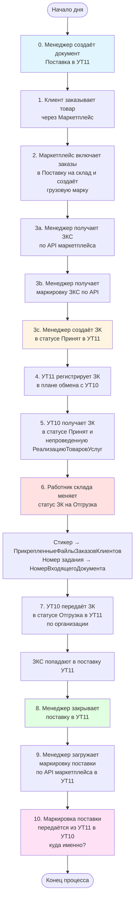
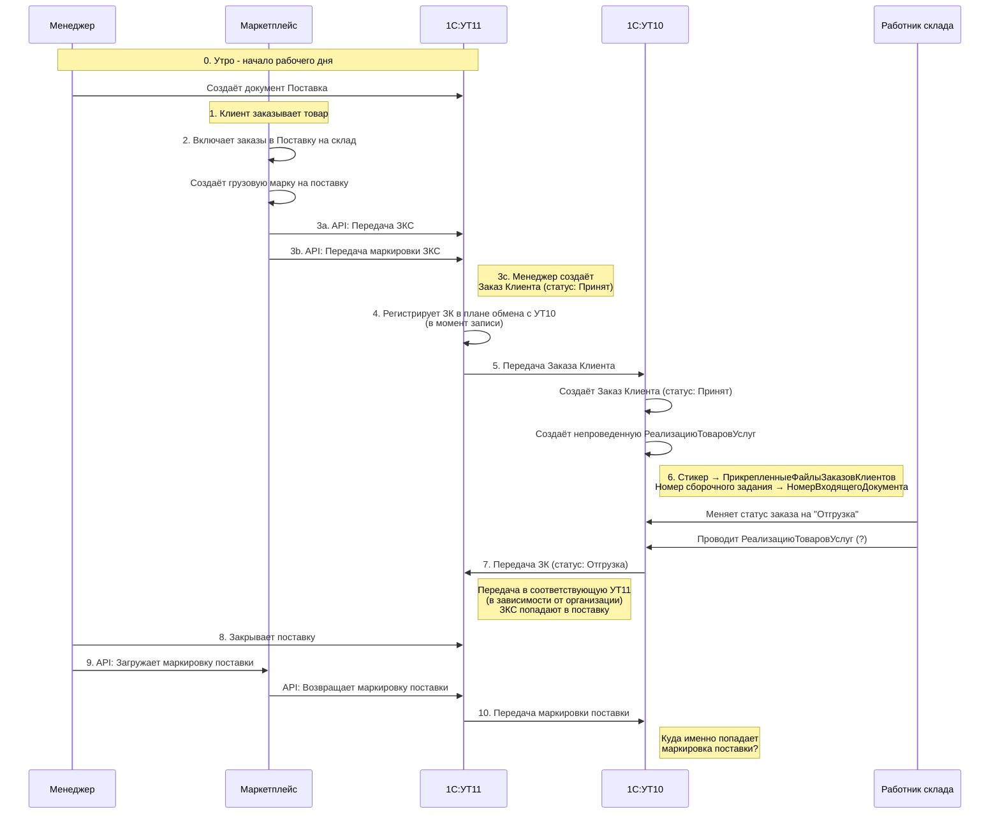

# Поток обработки заказов маркетплейса

## Описание процесса

0. Менеджер утром создаёт документ Поставка в УТ11
1. Клиент заказывает товар через Маркетплейс
2. Маркетплейс включает заказы в Поставку на склад, создаёт грузовую марку на поставку
3. Менеджер в УТ11:
   - Получает ЗКС по API маркетплейса, заказ попадает в систему
   - Получает маркировку ЗКС по API маркетплейса
   - Создаёт ЗК (в статусе Принят)
4. УТ11 регистрирует ЗК в плане обмена с УТ10 (в момент записи)
5. УТ10 получает ЗК в статусе Принят и непроведенную РеализациюТоваровУслуг
6. Работник склада меняет статус ЗК на Отгрузка (и проводит РеализациюТоваровУслуг?):
   - Стикер картинкой попадает в связанный справочник ПрикрепленныеФайлыЗаказовКлиентов
   - Номер сборочного задания попадает в типовой реквизит ЗК НомерВходящегоДокумента
7. УТ10 передаёт ЗК в статусе Отгрузка в одну из УТ11 (в зависимости от организации)
   - ЗКС попадают в поставку УТ11 в процессе обмена при смене статуса ЗК
8. Менеджер закрывает поставку в УТ11
9. Менеджер загружает маркировку поставки в УТ11 по API маркетплейса
10. Маркировка поставки передаётся из УТ11 в УТ10 (куда именно?)

## Диаграмма потока



## Системы и роли

- **УТ11** - Управление торговлей (филиал/подразделение)
- **УТ10** - Управление торговлей (центральная система)
- **Маркетплейс** - Внешняя торговая площадка
- **Менеджер** - Обрабатывает заказы в УТ11
- **Работник склада** - Выполняет отгрузку в УТ10

## Вопросы для уточнения

1. На шаге 6: проводится ли РеализациюТоваровУслуг при смене статуса?
2. На шаге 10: куда именно передаётся маркировка поставки в УТ10?
```


## Диаграмма последовательности


