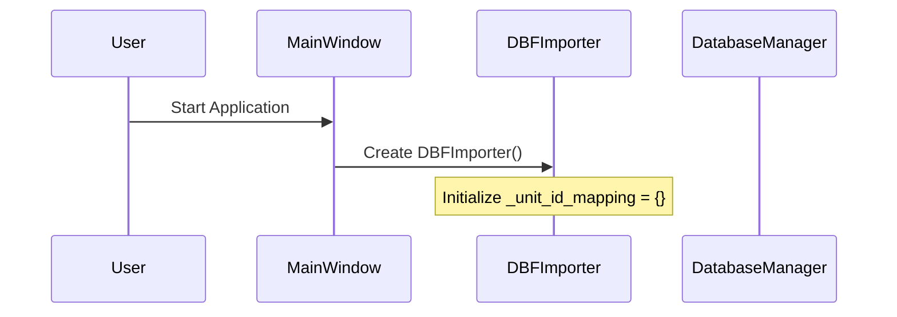
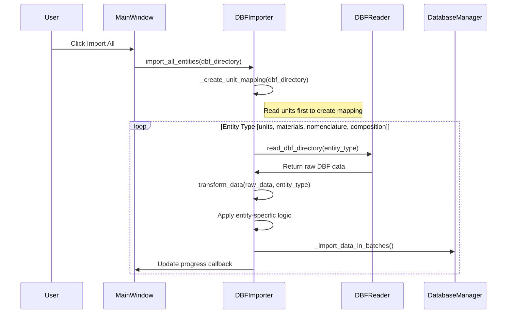
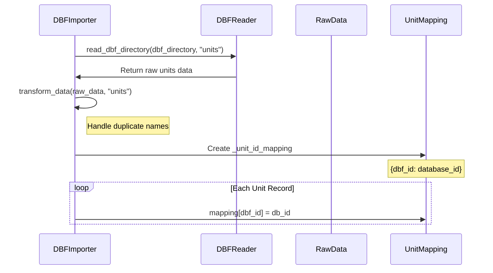
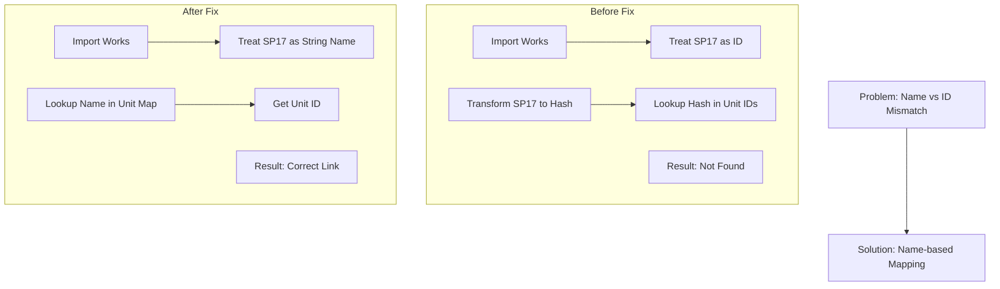

# DBF Importer - Measure Units Fix - Process Flow Diagrams

## Overview
This document shows the detailed sequence and data flow for the DBF importer measure units fix, linking the process to the actual code implementation.

## 1. High-Level Architecture

```mermaid
graph TD
    A[DBF Files] --> B[DBF Reader]
    B --> C[DBF Importer]
    C --> D[Database Manager]
    C --> E[Unit ID/Name Mapping]
    C --> F[UI Components]
    
    subgraph "DBF Files"
        A1[SC46.DBF - Units]
        A2[SC12.DBF - Works/Nomenclature]
        A3[SC25.DBF - Materials]
        A4[SC20.DBF - Composition]
    end
    
    subgraph "Import Process"
        B1[Read DBF Data]
        B2[Transform Data]
        B2a[Normalize & Deduplicate Units]
        B3[Apply Unit Mapping (Name -> ID)]
        B4[Batch Import to Database]
        B5[Update Progress]
    end
    
    note right of B2a
      Normalization: Strip whitespace
      Deduplication: Keep first occurrence
    end
    
    note right of B3
      Transformation Rule:
      Works.SP17 (String) -> Normalize -> Units.Name -> Units.ID
      Table: works
    end
```

## 2. Detailed Process Sequence

### Phase 1: Initialization


**Code Location**: [`Erection/dbf_importer/core/importer.py:20-24`](Erection/dbf_importer/core/importer.py:20)

### Phase 2: Import All Entities Process


**Code Location**: [`Erection/dbf_importer/core/importer.py:321-363`](Erection/dbf_importer/core/importer.py:321)

### Phase 3: Unit Mapping Creation


**Code Location**: [`Erection/dbf_importer/core/importer.py:365-394`](Erection/dbf_importer/core/importer.py:365)

### Phase 4: Works Import with Unit Mapping
```mermaid
sequenceDiagram
    participant Importer as DBFImporter
    participant Reader as DBFReader
    participant Mapping as UnitMapping
    participant Data as WorkData
    
    Importer->>Reader: read_dbf_directory(dbf_directory, "nomenclature")
    Reader->>Importer: Return raw works data
    Importer->>Importer: transform_data(raw_data, "nomenclature")
    
    loop Each Work Record
        Importer->>Mapping: unit_id = record.get("unit_id")
        alt Unit ID exists in Mapping
            Importer->>Mapping: record["unit_id"] = mapping[unit_id]
        else Unit ID not found
            Importer->>Importer: Log warning & set unit_id = None
    end
```

**Code Location**: [`Erection/dbf_importer/core/importer.py:112-121`](Erection/dbf_importer/core/importer.py:112)

## 3. Data Flow Diagrams

### 3.1 Unit Mapping Data Structure
```mermaid
graph LR
    subgraph "DBF Unit Data"
        U1[DBF_ID: 1, Name: m2]
        U2[DBF_ID: 2, Name: m2]
        U3[DBF_ID: 3, Name: "kg "]
    end
    
    subgraph "Canonical/Transformed Unit Data"
        TU1[DB_ID: 1, Name: m2]
        TU3[DB_ID: 3, Name: kg]
    end
    
    subgraph "Unit Mapping Dictionary"
        M1["1": 1]
        M2["2": 1]
        M3["m2": 1]
        M4["kg": 3]
    end
    
    U1 --> TU1
    U2 -- Duplicate ignored --> TU1
    U3 -- Normalized --> TU3
    
    TU1 --> M1
    TU1 --> M3
    U2 --> M2
    TU3 --> M4
```

### 3.2 Works Import Flow
```mermaid
flowchart TD
    A[Start: Read SC12.DBF] --> B[Transform: Read SP17 as String]
    B --> B1[Normalize: Strip whitespace]
    B1 --> C[Map: Lookup Unit Name in Mapping]
    C --> D[Validate: Check if unit_name_ref exists in mapping]
    D --> E[Update: Set correct unit_id from mapping]
    E --> F[Import: Batch insert to works table]
    
    G[Parallel: Unit Mapping Created] --> C
    G -.-> H[Mapping Dictionary: {name: db_id, id: db_id}]
    H --> E
```

## 4. Key Code Components

### 4.1 DBFReader Class
**File**: [`Erection/dbf_importer/core/dbf_reader.py`](Erection/dbf_importer/core/dbf_reader.py)

**Key Methods**:
- `read_dbf_directory(directory, entity_type)` - Reads specific DBF file based on entity type
- `transform_data(data, entity_type)` - Converts DBF field names to database field names
- **ID Conversion Logic** (lines 120-136):
  ```python
  if db_field == "id" or db_field.endswith("_id"):
      if isinstance(value, str):
          try:
              clean_value = value.strip()
              if clean_value:
                  transformed_record[db_field] = int(clean_value, 16)
          except (ValueError, TypeError):
              transformed_record[db_field] = zlib.crc32(clean_value.encode(self.encoding, errors='ignore')) & 0x7FFFFFFF
  ```

### 4.2 DBFImporter Class
**File**: [`Erection/dbf_importer/core/importer.py`](Erection/dbf_importer/core/importer.py)

**Key Methods**:
- `__init__(progress_callback)` - Initializes importer and unit mapping
- `_create_unit_mapping(dbf_directory)` - Creates unit ID mapping before imports
- `import_entity(dbf_path, entity_type, ...)` - Imports single entity type
- `import_all_entities(dbf_directory, ...)` - Orchestrates complete import process
- `_import_data_in_batches(data, table_name, entity_type)` - Handles batch database operations

**Unit Mapping Logic** (lines 112-121):
```python
if entity_type == "nomenclature":
    for record in data:
        unit_id = record.get("unit_id")
        if unit_id is not None and unit_id in self._unit_id_mapping:
            record["unit_id"] = self._unit_id_mapping[unit_id]
        else:
            logger.warning(f"Не найден unit_id {unit_id} в сопоставлении для работы {record.get('name')}")
            record["unit_id"] = None
```

### 4.3 Database Manager
**File**: [`Erection/dbf_importer/core/database.py`](Erection/dbf_importer/core/database.py)

**Key Methods**:
- `update_or_insert_records(table_name, records)` - Handles batch insert/update operations
- `table_exists(table_name)` - Checks if database table exists
- `get_session()` - Creates database session

### 4.4 Configuration Settings
**File**: [`Erection/dbf_importer/config/settings.py`](Erection/dbf_importer/config/settings.py)

**Key Configuration**:
```python
DBF_FIELD_MAPPING = {
    "units": {
        "table": "units",
        "dbf_file": "SC46.DBF",
        "fields": {
            "ID": "id",
            "DESCR": "name",
            "CODE": "description",
            "ISMARK": "marked_for_deletion"
        }
    },
    "nomenclature": {
        "table": "works",
        "dbf_file": "SC12.DBF",
        "fields": {
            "ID": "id",
            "DESCR": "name",
            "PARENTID": "parent_id",
            "CODE": "code",
            "SP17": "unit_name_ref",  # Critical: Links to units table by NAME
            "SP15": "price",
            "SP31": "labor_rate",
            "ISMARK": "marked_for_deletion"
        }
    }
}

DBF_DEFAULT_PATH = "F:\\traeRepo\\Vibe1Co\\Erection\\8-NSM320-1Cv7"
```

## 5. Problem-Solution Mapping

### 5.1 Original Problem
- **Issue**: Unit references in works (SC12.DBF) were not being properly linked to actual units in database
- **Root Cause**: Works DBF (SC12) contains unit *names* (strings) in `SP17`, but importer treated them as IDs, causing hash mismatch with Unit IDs
- **Impact**: Works would have `unit_id = None` instead of valid unit references

### 5.2 Solution Architecture


### 5.3 Implementation Strategy
1.  **Preprocessing Phase**: Create unit mapping (ID->ID and Name->ID) before any entity imports
2.  **Mapping Persistence**: Store mapping in instance variable
3.  **Reference Resolution**: Look up unit by name (`unit_name_ref`) during works import
4.  **Error Handling**: Graceful fallback when unit references are missing

## 6. Testing and Validation

### 6.1 Test Scenario
```python
# Test script validates the fix
def test_unit_import():
    importer = DBFImporter()
    
    # Step 1: Create unit mapping
    importer._create_unit_mapping(dbf_directory)
    
    # Step 2: Import units (builds mapping)
    importer.import_entity(dbf_directory, "units", clear_existing=True)
    
    # Step 3: Import works (uses existing mapping)
    importer.import_entity(dbf_directory, "nomenclature", clear_existing=False)
    
    # Validation: Check mapping persistence
    assert len(importer._unit_id_mapping) > 0
    # Verify works have correct unit_id values
```

### 6.2 Success Criteria
- ✅ Unit mapping contains entries
- ✅ Works records have valid `unit_id` values
- ✅ No "unit_id = None" for works that had units in DBF
- ✅ Database foreign key constraints satisfied

## 7. Benefits of the Fix

1. **Data Integrity**: Maintains referential integrity between works and units
2. **Performance**: Eliminates redundant unit mapping creation
3. **Reliability**: Consistent unit references across import sessions
4. **Maintainability**: Centralized mapping logic easier to debug
5. **User Experience**: Import button enabled at startup with default path

## 8. Usage Instructions

### 8.1 Running the Importer
```bash
# Using the fixed importer
python -m dbf_importer.main

# Or programmatic usage
from dbf_importer.core.importer import DBFImporter

importer = DBFImporter()
results = importer.import_all_entities(
    dbf_directory="F:\\traeRepo\\Vibe1Co\\Erection\\8-NSM320-1Cv7",
    clear_existing=True
)
```

### 8.2 Verifying the Fix
```sql
-- Check works with proper unit references
SELECT w.id, w.name, u.name as unit_name 
FROM works w 
LEFT JOIN units u ON w.unit_id = u.id 
WHERE w.unit_id IS NOT NULL 
LIMIT 10;

-- Should return 0 rows after fix
```

This comprehensive documentation shows how the measure units import fix resolves the data integrity issue through centralized unit ID mapping and proper reference resolution during the import process.